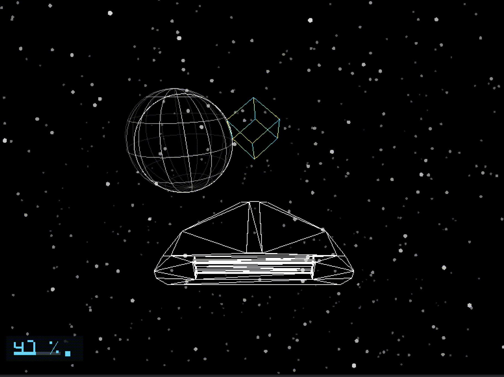

# dusk



`dusk` is a small SFML/C++ experiment that fakes 3D in a 2D window. There is no OpenGL, no depth buffer, no borrowed rendering pipeline underneath it — just a `Vec3` world, a hand-rolled camera and view matrix, a perspective projector, and SFML lines and shapes doing the actual drawing. Everything from vector math to frustum clipping to Newtonian ship physics is written from scratch, on purpose.

Pick PLAY, and you drop into a procedurally generated star system: a filled white sun, a handful of orbiting gridded planets, a rotating station cube, and a scatter of NPC ships going about their own simple-reflex business — all seeded from one number, with `[` and `]` letting you jump between systems while the real warp scene is still on the drawing board.

## Manifesto

`dusk` is a spare-time side project with no deadline and no syllabus behind it. It exists to answer one question: how would a vector-graphics game in the spirit of *Elite* (1984) be built today — same wireframe soul, same "everything is lines," but with more modern C++ underneath?

The constraint that makes it interesting is that SFML is only allowed to draw primitives (lines, circles, rectangles). Every transform, every clip, every collision check, every bit of orbit and thrust math is engine code that lives in this repository. That trades away convenience for the chance to actually understand a 3D pipeline from the vertex up.

## What's Actually Working Right Now

- A main menu with keyboard and mouse input, and a showcase camera orbiting the ship.
- Scene management, with scenes owning their own world and requesting transitions.
- A single `Galaxy` of 1000 deterministically generated systems, built from one seed at startup — same seed, same galaxy, every time.
- One reused `SystemScene` that regenerates its entire world from a system's own seed the moment you enter it, so system #217 always looks and plays out the same way.
- Real orbital mechanics: planets orbit a central star under actual Newtonian gravity, integrated with velocity Verlet, and the star's own gravity pulls on the player ship too.
- A rotating station cube procedurally placed in orbit around a random planet, in systems that roll one.
- Simple-reflex NPC ships that roam, avoid planets and stars, occasionally head to the station and dock, and periodically "warp out" and back in — no memory, no planning, just current-state reflexes.
- An "on-paper" economy and system-flavor layer: procedural system names, an economy tier, a dominant occupation, a handful of tradeable goods, and derived prices per system — generated, but not yet wired into any in-game trading UI.
- A camera that chases the ship from behind, plus an orbit "showcase" mode.
- A wireframe ship rendered from a vector model, with face culling and hidden-underside edges.
- OBJ loading, so you can swap the built-in ship for any triangulated wireframe model — the project ships with a `banshee.obj` model, used for both the player ship and every NPC ship.
- Velocity Verlet ship physics: real acceleration, real persistent velocity, and now real external gravity, all fed through the same integrator.
- Object-level collision detection (ship, cube, planets) using swept and static spherical volumes.
- A recycled, endless-feeling starfield.
- Frustum clipping for both points and line segments, with a small side guard-band so things don't visibly pop in at the frustum edges.
- A system's star drawn as a solid filled disc, and its planets drawn as gridded, optionally ringed wireframes — sorted and drawn back-to-front together, with per-edge visibility shading based on facing direction.
- A minimalist, font-free HUD showing throttle and thrust direction.

## Roadmap

Checked-off items are implemented today; everything else is a future direction, picked up whenever the mood strikes.

### Engine

- [x] C++/SFML projection and rendering system that fakes 3D rendering in 2D
- [x] Frustum clipping
- [x] Culling
- [x] Scene management
- [x] OBJ loader
- [x] Object-level collision detection
- [x] Integrator upgrade: velocity Verlet in place of explicit Euler
- [ ] Music and sound
- [ ] Rigid bodies

### Game

- [~] Procedural world generation
  - [x] Planets per system
  - [x] Systems (1000 generated per galaxy today)
  - [~] In-system and inter-system economy — prices compute per system, no trading UI yet
  - [x] Simple-reflex agent (S-RA) NPC ships
  - [ ] Missions
- [ ] End goal: reach the centre of the galaxy
- [~] Newtonian physics
  - [x] Ship thrust follows Newton's first law, integrated with velocity Verlet
  - [x] Objects act upon one another — the star and every planet exert real gravity on each other and on the ship
  - [ ] Towed cargo mass affects ship handling
- [~] Phase-space warp between system nodes — `[`/`]` system cycling stands in for it today
- [ ] Galactic map
- [ ] System map
- [ ] Spaceships
  - [ ] Chemical combustion ships
  - [ ] Electric ships
  - [ ] 20 ships total
- [~] World
  - [ ] Asteroid belts
  - [x] OBJ-loaded models
  - [x] Stars
  - [x] Planets
- [ ] Dynamic S-RA economy driven by supply and demand
- [x] System economy tiers (Poor / Developing / Progressive)
- [x] Tradeable goods (silicon chips, food, liquor, wines, ores, electronics, furs, animals, books, chemical fuel)
- [x] World occupations (mining, engineering and tech, agricultural)
- [ ] Mission variety (live cargo transport, mining, bounty hunting, cargo transport, station defence/offence)
- [~] NPC interactions — NPC ships roam, dock, and warp on their own; nothing talks to the player yet
- [ ] HUD
  - [x] Thrust
  - [ ] Relative velocity/pitch/yaw
  - [ ] Targeting, radar-esque
- [~] Physics
  - [x] Object-level collision hitboxes
  - [ ] Fuel expenditure (mass matters)
- [ ] Upgrades (docking computers, guns, scanners, fuel tanks, jump drives, mining gear)
- [~] Space stations: small, medium, large — one procedurally placed station cube per eligible system today
- [x] Wireframe graphics style
- [ ] Classical music for docking (*The Blue Danube*, for example)

P.S. I wanted to add something that breathes life without the player on the small scale — a system that reacts to itself almost on a clock, running in the background so the procedural world feels alive even when nobody is watching it.

## Build

Requirements:

- CMake 4.3 or newer, matching the current `CMakeLists.txt`.
- A C++23 compiler.
- SFML 3 with the Graphics, Window, and System components.

Configure and build:

```sh
cmake -S . -B build
cmake --build build
```

Run:

```sh
./build/dusk
```

Game assets (fonts, OBJ ship models) are copied into the build directory automatically from `assets/`.

## Controls

The main menu accepts:

- `Enter` or `Space`: start the first test scene.
- Mouse click on `PLAY`: start the first test scene.
- Mouse click on `EXIT`, or `Escape`: quit.

Playable scenes use a ship-first input pipeline:

```text
keyboard -> ship controls -> ship physics -> camera follows ship -> render
```

Flight controls:

- `W`: increase throttle.
- `S`: decrease throttle.
- `Arrow Down`: toggle forward/reverse thrust and reset throttle to `0`.
- `A`: yaw ship left.
- `D`: yaw ship right.
- `Q`: pitch nose up.
- `E`: pitch nose down.
- `Arrow Up`: hold to orbit the camera around the ship (showcase mode) instead of chasing it.
- `Escape`: quit.

Once you're in a system:

- `]`: jump to the next system in the galaxy.
- `[`: jump to the previous system.

This is a deliberate stand-in for a proper warp/phase-space scene — it regenerates the destination system from its own seed and drops you in, instantly, so the orbital-mechanics and NPC-behavior work can be tested across many systems without a travel scene to build first.

Because movement is velocity-based, easing off the throttle does not stop the ship. It only stops adding acceleration — the ship keeps drifting on whatever velocity it already built up. To brake:

1. Tap `Arrow Down` to switch to reverse thrust (this also zeroes throttle).
2. Hold `W` to build up reverse thrust.
3. Ease off with `S`, or toggle direction again once you're near a stop.

## Project Layout

```text
src/
  main.cpp

include/
  io/
    obj_loader.h++

  math/
    Vec2.h++
    Vec3.h++
    Mat4.h++
    verlet.h++

  model/
    vector_model.h++

  objects/
    ship.h++
    npc_ship.h++
    cube.h++
    planet.h++
    star.h++
    collision_body.h++

  procgen/
    statistical.h++
    galaxy.h++
    planet_generation.h++

  scenes/
    scene.h++
    scene_manager.h++
    main_menu.h++
    system_scene.h++
    default_scene.h++

  systems/
    ship_physics.h++
    orbital_physics.h++
    npc_ai.h++
    economy.h++

  tools/
    camera.h++
    camera_controller.h++
    ship_controller.h++

  world/
    world.h++
    starfield.h++

  rendering/
    projector.h++
    star_renderer.h++
    planet_renderer.h++
    cube_renderer.h++
    ship_renderer.h++
    hud_renderer.h++

assets/
  fonts/
    Jersey15-Regular.ttf
  objects/
    ships/
      banshee.obj
```

The important separation is:

- `objects/`: data and local per-object helper functions (a `Cube`, a `Planet`, a `Ship`, an `NpcShip`, a `Star`, a `CollisionBody`).
- `model/`: the shared wire/vector model format used by anything drawn as lines and faces.
- `io/`: file loading and conversion, currently OBJ-to-vector-model.
- `procgen/`: deterministic, seed-in/data-out generation — galaxy roster, per-system flavor text and stats, and the star/planet/station/spawn placement that builds an actual `World` from that data.
- `scenes/`: the scene interface, active-scene ownership, and the concrete scene presets.
- `systems/`: simulation logic that isn't tied to any one object type — ship physics, orbital physics, NPC AI, and economy pricing.
- `tools/`: input handling and camera behavior.
- `world/`: ownership and per-frame updates of everything that exists in world coordinates, including collision detection.
- `rendering/`: code that turns world/camera state into pixels.
- `src/main.cpp`: orchestration only — it should stay boring.

`main.cpp`'s frame loop is intentionally simple:

```cpp
if (sceneManager.activeScene().acceptsShipInput())
    updateShipFromKeyboard(world.playerShip, dt, shipInputState);

sceneManager.activeScene().updatePhysics(dt);
sceneManager.activeScene().updateCamera(camera, dt, shipCameraRig);
sceneManager.activeScene().updateStreaming(camera);
applySceneTransition(sceneManager.activeScene().consumeTransition());

starRenderer.draw(window, world.starfield.stars(), camera);
planetRenderer.drawSystem(window, world.star, world.planets, camera);

if (world.cubeActive)
    cubeRenderer.draw(window, world.cube, camera);

shipRenderer.draw(window, world.playerShip, camera);

for (const NpcShip& npc : world.npcShips)
{
    if (npc.isVisible())
        shipRenderer.draw(window, npc.ship, camera);
}

if (sceneManager.activeScene().showsHud())
    hudRenderer.draw(window, world.playerShip);

sceneManager.activeScene().drawOverlay(window);
```

Input, physics, camera, streaming, transitions, and rendering never tangle together — each step reads the world, does its one job, and hands off to the next. The player ship and the galaxy's central star both get the special treatment (dedicated `shipRenderer.draw()` call, `drawSystem()` folding the star in with its planets), while NPC ships reuse the exact same `shipRenderer` as the player, just looped over and gated on whether the given NPC is currently in a visible state.

## The World Coordinate Model

Everything exists in world coordinates as `Vec3` values:

```cpp
struct Vec3 {
    float x = 0.f, y = 0.f, z = 0.f;
};
```

The convention used throughout the project is:

- `+x`: right.
- `+y`: up.
- `+z`: forward.

Each scene owns a `World`:

```cpp
struct World {
    Starfield starfield;
    Cube cube;
    bool cubeActive = true;
    std::vector<Planet> planets;
    std::vector<NpcShip> npcShips;
    std::mt19937 npcRng;
    float systemOuterRadius = 40000.f;

    /** Central star. Always static — never touched by orbital integration. */
    Planet star;

    int stationHostPlanetIndex = -1;
    float stationOrbitRadius = 0.f;
    float stationOrbitAngle = 0.f;
    float stationOrbitSpeed = 0.15f;

    Ship playerShip;
};
```

Note that the star reuses the `Planet` type with an `isStar` flag set, rather than being its own struct — it needs the same position, mass, and radius fields planets already have, and the renderer/gravity code both just check that one flag when a body needs star-specific treatment. The `cube` field, meanwhile, has quietly become the system's station: `stationHostPlanetIndex`/`stationOrbitRadius`/`stationOrbitAngle` describe how it orbits whichever planet it was procedurally assigned to.

The ship is just another object living in world coordinates. The camera follows it, but the ship doesn't "belong" to the camera — that relationship only exists in the camera-controller code:

```text
Ship has world position and velocity.
Camera chooses a world position behind/up from the ship.
Renderer transforms world positions into camera space.
Projector turns camera space into screen pixels.
```

`main.cpp` never constructs world objects directly. It asks the scene manager for the active scene, and the scene owns everything from there:

```cpp
SceneManager sceneManager;
sceneManager.setScene<MainMenuScene>();
World& world = sceneManager.world();
```

## How Fake 3D Rendering Works

There's no OpenGL, no depth buffer, no real 3D meshes on the GPU. `dusk` keeps 3D coordinates on the CPU and manually projects them onto a 2D SFML window every frame. All of this lives in `include/rendering/projector.h++`.

Projection happens in two broad steps:

1. Convert a point from world space into camera space.
2. Convert camera space into screen space.

### World Space To Camera Space

World space is the shared coordinate system everything lives in. Camera space is the same coordinates re-expressed from the camera's point of view:

- The camera sits at the origin.
- `+z` is in front of the camera.
- `+x` is right on screen.
- `+y` is up on screen.

The camera builds a view matrix from an orthonormal basis of its own right/up/forward vectors:

```cpp
Mat4 createViewMatrix(const Camera& camera) const;
```

A world point is transformed into camera space with:

```cpp
Vec3 cameraSpace = transformPoint(viewMatrix, worldPosition);
```

The view matrix folds in the camera's position too, so the result is already relative to the camera, roll included.

### Camera Space To Screen Space

Once a point is in camera space, perspective projection is a straightforward divide:

```text
screenX = centerX + cameraX * focalLength / cameraZ
screenY = centerY - cameraY * focalLength / cameraZ
```

`cameraZ` is depth. As depth grows, the division makes things shrink toward the center of the screen — the usual perspective illusion. Focal length comes from the vertical field of view:

```text
focalLength = viewportHeight * 0.5 / tan(fov * 0.5)
```

A narrow FOV gives a larger focal length and feels more zoomed in; a wide FOV gives a smaller one and feels more zoomed out.

### Frustum Clipping

The frustum is the visible pyramid of space in front of the camera:

```cpp
struct Frustum {
    float nearPlane;
    float farPlane;
    float halfVerticalFovTan;
    float aspect;
};
```

For a single point, clipping just checks whether `z` sits between the near and far planes, and whether `x`/`y` sit inside the FOV cone at that depth. For a line — cube edges, ship edges, planet grid segments — the projector clips the whole segment against all six frustum planes before projecting either endpoint, using a Liang–Barsky-style parametric clip in `clipLineCameraSpace`. This avoids the visual glitches you'd get from projecting a point that's behind the camera or wildly outside the FOV.

`ProjectionConfig::sideGuardBand` pads the horizontal/vertical FOV slightly during clipping, so objects don't visibly pop in and out right at the screen edge.

### Face Culling

`Projector::isFrontFacing()` takes three camera-space triangle vertices, computes the wound face normal, and checks whether it points back toward the camera. Ship rendering uses this per-triangle-face result to decide which wire edges belong to a currently visible face versus a currently hidden one, so the wireframe doesn't show through the far side of the hull.

## The Ship

Ship state lives in `include/objects/ship.h++`:

```cpp
struct Ship {
    Vec3 position;
    Vec3 previousPosition;
    Vec3 velocity;
    CollisionBody collision;
    float collisionRadius = 140.f;

    float yaw;
    float pitch;
    float throttle;
    bool reverseThrust;

    float maxThrust = 1000.f;
    float throttleChangeSpeed = 0.5f;
    float yawSpeed = 0.8f;
    float pitchSpeed = 0.8f;
    float mass = 15.f;

    VectorModel model = createDefaultShipModel();
};
```

Orientation helpers keep physics and rendering agreeing about which way the ship is pointing:

```cpp
Vec3 shipForward(const Ship& ship);
Vec3 shipRight(const Ship& ship);
Vec3 shipUp(const Ship& ship);
Vec3 shipLocalToWorld(const Ship& ship, const Vec3& local);
```

If no OBJ is loaded, the ship falls back to a small built-in Sidewinder-inspired vector model (`createDefaultShipModel()`). In practice, every `Ship` in the game — the player's and every `NpcShip`'s alike — loads `assets/objects/ships/banshee.obj` on entry to a system, each with its own corrective `ObjLoadOptions` rotation, since the source model wasn't authored nose-forward along `+z`. `NpcShip` (`include/objects/npc_ship.h++`) just wraps a `Ship` with a small AI state machine bolted on top, which is exactly why NPCs get the same model, the same physics, and the same renderer as the player for free.

## Ship Physics

Physics lives in `include/systems/ship_physics.h++`, and the underlying integrator lives in `include/math/verlet.h++`.

Thrust force comes straight from ship controls:

```cpp
inline Vec3 shipThrustForce(const Ship& ship)
{
    const float thrustDirection = ship.reverseThrust ? -1.f : 1.f;
    return shipForward(ship) * ship.maxThrust * ship.throttle * thrustDirection;
}
```

Acceleration divides that by mass and adds in whatever external acceleration the caller passes — today, that's gravity from the system's star and planets:

```cpp
inline Vec3 shipAcceleration(const Ship& ship, const Vec3& externalAcceleration = {})
{
    if (ship.mass <= 0.f)
        return externalAcceleration;

    return shipThrustForce(ship) / ship.mass + externalAcceleration;
}
```

Position and velocity are then advanced with velocity Verlet rather than explicit Euler, which keeps the integration closer to the true phase-space trajectory:

```cpp
inline void integrateShipPhysics(Ship& ship, float dt, const Vec3& externalAcceleration = {})
{
    ship.previousPosition = ship.position;

    const Vec3 acceleration = shipAcceleration(ship, externalAcceleration);

    ship.position = verlet::position_update(ship.position, ship.velocity, acceleration, dt);
    ship.velocity = verlet::velocity_update(ship.velocity, acceleration, acceleration, dt);
}
```

`World` computes that external acceleration once per frame via `gravityOnShip()`, which sums `orbital::gravitationalAcceleration()` contributions from the star and every planet at the ship's current position, and hands it straight to `integrateShipPhysics()`. NPC ships go through the same function with their own local gravity sample, so the player and every NPC share one physics code path.

`verlet::position_update` and `verlet::velocity_update` are small, reusable, and not ship-specific — they only need a displacement/velocity/acceleration and a timestep, which is exactly why `orbital_physics.h++` reuses them directly for planet motion instead of writing a second integrator.

There is intentionally no drag yet. If the ship gains velocity, it keeps that velocity until thrust (or gravity) changes it — see the Controls section above for how to actually stop.

`ship.previousPosition` is also what makes swept collision detection possible: it's the "where was I a moment ago" needed to catch a fast-moving ship that tunnels through a thin collision volume between frames.

## Collision Detection

Collision state and detection live in `include/objects/collision_body.h++`, wired together per-frame in `include/world/world.h++`.

Every collidable object carries a `CollisionBody`:

```cpp
struct CollisionBody {
    bool detectsCollisions = true;
    std::vector<CollisionHit> hits;
};
```

Each `CollisionHit` records which type of object was touched (`Ship`, `Cube`, or `Planet`), an index (for collections like `planets`), a unit normal pointing from this object toward the other, and how far the two volumes overlap.

Every physics tick, `World::updateWorldPhysics()`:

1. Integrates ship physics and updates the cube's rotation.
2. Clears every object's hits from last frame.
3. Runs a **swept sphere** test for the ship against the cube and against every planet — swept, because the ship moves fast enough in one frame that a plain sphere-overlap test could miss it clipping straight through something.
4. Runs plain **sphere-sphere** tests between the cube and each planet, and between every pair of planets.
5. Registers each hit symmetrically on both objects involved.

`Cube` and `Planet` each expose a `*CollisionRadius()` helper so the collision system doesn't need to know how their visual size maps to a collision volume. The procedurally generated station cube sets `collision.detectsCollisions = false` on itself, so today it's purely decorative furniture in orbit rather than something you can bump into — a natural hook for a future docking mechanic, but not wired up yet.

NPC ships currently sit outside this system entirely: they steer around planets and the star through their own AI (see below), but they don't carry a `CollisionBody` and never appear in `updateWorldCollisions()`.

## Orbital Physics And Gravity

Orbital mechanics live in `include/systems/orbital_physics.h++`, under the `orbital` namespace, and reuse the same `verlet::` integrator functions as ship physics.

Gravity between any two bodies is a simple inverse-square pull, with a softening floor so it doesn't spike toward infinity at very close range:

```cpp
constexpr float g = 600.f;          // tuned for this project's world-unit scale, not SI units
constexpr float minDistance = 200.f;

inline Vec3 gravitationalAcceleration(const Vec3& from, const Vec3& toward, float towardMass)
{
    const Vec3 offset = toward - from;
    const float distance = std::max(length(offset), minDistance);
    const float accelerationMagnitude = g * towardMass / (distance * distance);
    return normalized(offset) * accelerationMagnitude;
}
```

Every physics tick, `World::updateWorldPhysics()` calls `orbital::integrateOrbitalPhysics()`, which sums gravity on each planet from the (fixed) star and every other planet, then advances every planet's position and velocity with velocity Verlet — a real, if small-scale, N-body simulation, not a scripted orbit path. The star itself never moves or accelerates; it's the one fixed anchor everything else orbits.

The same `gravitationalAcceleration()` function is what `World::gravityOnShip()` uses to work out how hard the star and planets are currently pulling on the player, and it's what `npc_ai::updateNpcShip()` samples for each NPC before calling the shared `integrateShipPhysics()`. One gravity function, three different things being pulled around by it.

`circularOrbitVelocity()` is the other half of the picture — given a position, a center, and a central mass, it returns the tangential velocity needed for a (roughly) circular orbit at that distance. Procedural planet generation uses it to hand every new planet a starting velocity that won't immediately spiral it into the star or fling it out of the system.

## Procedural Galaxy Generation

Procedural generation lives in `include/procgen/`, split across three files with very different jobs:

- `statistical.h++` generates the cheap, "on-paper" facts about a system — a pronounceable procedural name, an `EconomyTier` (Poor/Developing/Progressive, weighted toward Poor), a dominant occupation, 2–4 goods it best sells, and rolled counts for planets, stations, and NPC ships. All of this is packed into a `SystemInfo` and is cheap enough to generate and hold 1000 of at once, up front.
- `galaxy.h++` derives a stable per-system seed from one galaxy seed plus a system index (`deriveSystemSeed()`), and calls `generateSystemInfo()` for every system to build the full `Galaxy` roster.
- `planet_generation.h++` is where a `SystemInfo` actually becomes a playable `World`: it builds the star, places planets in outward, non-overlapping orbital shells with a real circular-orbit starting velocity, optionally places a station in orbit around a random planet, and works out a safe ship spawn point that won't drop you inside a planet or the star.

The key idea holding this together is **determinism**: `generateGalaxy(seed)` always produces the same 1000 `SystemInfo` entries for the same seed, and `deriveSystemSeed(seed, systemIndex)` always produces the same per-system seed — so `SystemScene::enterSystem(217)` rebuilds the exact same system every single time you visit it, without anything needing to be saved to disk.

`main.cpp` builds the one `Galaxy` for the whole run:

```cpp
Galaxy galaxy = generateGalaxy(1337u); // TODO: seed from a save file or menu input later
```

## Stations

There's no dedicated `Station` object yet — `procgen::generateStationPlacement()` picks a random host planet from the system's planets, then reuses the existing `Cube` type as the station's visual and world-position stand-in, orbiting that planet at a rolled radius, angle, and speed. `World::updateStationOrbit()` advances `stationOrbitAngle` every physics tick and recomputes `world.cube.position` relative to whichever planet is hosting it — which matters, since planets themselves are now moving bodies under orbital physics, not fixed points.

`SystemInfo::stationCount` is rolled per system but only the first station currently gets built; multi-station systems are a straightforward extension once there's a real `Station` type worth introducing.

## NPC Ships And Simple-Reflex AI

NPC ship data lives in `include/objects/npc_ship.h++`; the behavior lives in `include/systems/npc_ai.h++`, under the `npc_ai` namespace.

An `NpcShip` is just a `Ship` (so it gets the exact same model, physics, and renderer as the player) plus a small state machine on top:

```cpp
enum class NpcState {
    Inactive,        // warped out, invisible, waiting to respawn
    Roaming,         // flying toward a roam waypoint, avoiding hazards
    HeadingToStation,
    Docked,          // paused at the station, invisible
    WarpingOut       // brief wind-up before vanishing
};
```

This is a **simple-reflex agent** in the classical AI sense: `npc_ai::desiredDirection()` decides where to steer purely from the NPC's current position and its immediate surroundings — seek the current target, and blend in an avoidance vector away from any body (star or planet) it's currently too close to, with avoidance dominating the moment a hazard gets near. There's no path planning and no memory of anything beyond the current target; the same inputs always produce the same steering decision.

Each tick, `npc_ai::updateNpcShip()`:

1. Advances a per-NPC state timer.
2. While `Inactive`, waits out a randomized `wakeDelay` before respawning the NPC at a safe point via `respawnNpc()` (the "warp in").
3. While `Roaming` or `HeadingToStation`, computes a steering direction, turns the ship toward it at a limited rate (`steerToward()`), holds a cruise throttle, and integrates physics (gravity included) through the same `integrateShipPhysics()` the player uses.
4. On arrival at its target, rolls whether to head to the station, warp out, or pick a fresh roam waypoint.
5. While `Docked` or `WarpingOut`, waits out a randomized duration before transitioning onward.

`NpcShip::isVisible()` is what `main.cpp`'s render loop checks before drawing an NPC — `Inactive` and `Docked` ships are deliberately invisible, standing in for "not currently in this volume of space" until there's an actual station interior or warp-in effect to show instead.

## Economy (On Paper)

`include/systems/economy.h++` is a small, pure pricing layer on top of `procgen::SystemInfo`. `computeSystemPrices()` takes a system's rolled goods and economy tier and returns a `GoodPrice` per good — poorer systems pay more for everything, wealthier ones undercut the galaxy-wide base price, and a system's own specialty goods sell at a further local-surplus discount.

Nothing in the game currently displays these prices or lets the player buy or sell anything — this is infrastructure for the trading/economy loop on the roadmap, deliberately kept as a pure function of already-generated data so it's cheap to call from a future map or station UI without needing its own persistent state yet.

## The Camera

Camera state lives in `include/tools/camera.h++`; ship-following behavior lives in `include/tools/ship_controller.h++`.

Every scene updates the camera through:

```cpp
updateShipCamera(camera, world.playerShip, dt, shipCameraRig);
```

Normal ("chase") mode:

- Camera sits behind the ship along `-shipForward`.
- Camera sits above the ship along world up.
- Camera looks at a point ahead of the ship.

Showcase mode (hold `Arrow Up`):

- Camera orbits the ship at a fixed distance and height.
- Useful for admiring the wireframe model, and what the main menu uses by default to show off the ship.

There's a second, free-flying camera controller in `include/tools/camera_controller.h++` (WASD + QE + arrow-key look) that isn't wired into any current scene, but is there if you want an unattached debug camera.

## The Starfield

The starfield lives in `include/world/starfield.h++`. It doesn't create infinite stars — it keeps a fixed pool (`starCount = 3000`) scattered randomly through a cubic volume (`radius = 30000.f`) centered somewhere in world space.

When the camera drifts far enough from that center (past `radius * recycleThreshold`), the whole pool re-scatters around the camera's new position. Individual stars that drift outside the volume between recenters are recycled one at a time instead. The illusion of endless space comes from recycling, not from actually simulating an endless field.

## The Ship And Cube Renderers

The ship renderer (`include/rendering/ship_renderer.h++`) draws a `VectorModel`:

```cpp
struct VectorModel {
    std::vector<Vec3> vertices;
    std::vector<VectorLine> lines;
    std::vector<VectorFace> faces;
};

struct VectorLine {
    int start = 0;
    int end = 0;
    bool hideWhenViewedFromAbove = false;
};
```

`hideWhenViewedFromAbove` is a hand-authored hint (used by the built-in Sidewinder-style model) for underside lines that shouldn't show through the hull when the camera is above the ship. OBJ-imported models don't have that hint automatically, but nothing stops you from setting it on `ship.model.lines` after loading.

Faces exist purely to drive culling: for every triangle that has actual area, the renderer computes whether it currently faces the camera, and only lets a wire edge survive if it belongs to no face at all, or to at least one currently-visible face.

Draw path, start to finish:

```text
local ship vertex
  -> shipLocalToWorld()
  -> camera view matrix
  -> face culling
  -> frustum line clipping
  -> projection
  -> SFML line draw
```

The cube renderer (`include/rendering/cube_renderer.h++`) is the simpler cousin of the same idea — no face culling, just eight rotated/translated corners, twelve fixed edges, clip, project, draw — useful as a smaller reference if the ship renderer feels like a lot to take in at once. It's the same `Cube` type and renderer originally built to sanity-check camera rotation and projection; today it's repurposed to draw the procedurally placed station orbiting a planet.

## The Planet Renderer

`include/rendering/planet_renderer.h++` draws each planet as a latitude/longitude wireframe grid plus a solid silhouette outline, optionally with a flattened elliptical ring. Bodies are projected, culled if off-screen or too small, then depth-sorted and drawn back-to-front together so overlapping bodies composite correctly without a depth buffer. Grid line brightness is shaded per-segment based on how directly that patch of the sphere faces the camera, which is what gives the far side of a planet its dimmer, more silhouette-like look.

`main.cpp` calls `planetRenderer.drawSystem(window, world.star, world.planets, camera)`, which folds the star into the same sorted draw pass as the planets — but any body with `isStar == true` skips the wireframe grid entirely and is drawn as a simple filled white disc instead (`drawFilledStar()`), which is what actually makes a system's sun read as a sun rather than another wire sphere. A plain `draw(window, planets, camera)` overload still exists for drawing planets alone, without a star.

## OBJ Loading

OBJ loading lives in `include/io/obj_loader.h++` and converts OBJ text straight into the engine's `VectorModel` format:

```cpp
std::optional<VectorModel> loadObjFileAsVectorModel(
    const std::string& path,
    const ObjLoadOptions& options = {}
);
```

Supported OBJ records:

- `v x y z`: vertices.
- `f ...`: face boundaries become unique wire edges, and faces are triangulated for culling.
- `l ...`: explicit line records become wire edges too.

Ignored: normals, UVs, materials, smoothing groups, groups. `dusk` only needs wireframe geometry and face windings, so anything else in the file is simply skipped.

`ObjLoadOptions` controls how raw OBJ vertices become local ship-space vertices:

```cpp
struct ObjLoadOptions {
    float scale = 1.f;
    Vec3 offset;
    Vec3 rotationDegrees;
    bool centerOnOrigin = true;
    bool flipZ = false;
    bool flipX = false;
    bool flipY = false;
};
```

Per vertex, the loader applies flips, then rotates around local X, then Y, then Z (`rotationDegrees`), then scales. After every vertex is transformed, the whole model is optionally recentered on its transformed bounding box (`centerOnOrigin`), and finally offset. Flipping an odd number of axes mirrors the model and reverses triangle winding, so the loader automatically flips face winding back to correct in that case (`reversesObjWinding`) — you don't need to think about winding yourself when you flip an axis to fix an imported model's handedness.

OBJ indices are 1-based and may be negative (relative-from-the-end), and slash-separated (`f 1/1/1 2/2/1 3/3/1`) — only the vertex index before the first slash is used.

### Loading An OBJ Into The Ship

```cpp
ObjLoadOptions options;
options.scale = 100.f;
options.rotationDegrees = {-90.f, 0.f, 0.f};
options.centerOnOrigin = true;
world_.playerShip.loadObjModel("assets/objects/ships/banshee.obj", options);
```

That's what `SystemScene` loads the player into today (`MainMenuScene` uses a slightly different `scale`/`rotationDegrees` pairing for its showcase ship, and every `NpcShip` loads the same file again with its own `ObjLoadOptions` — nothing stops different objects from importing the same source file with different corrective rotations). The rotation corrects for the model's original forward axis, and centering on origin keeps `ship.position` (and therefore the follow camera) anchored to the visible model's actual center, even though the source file wasn't authored around its own origin.

If `loadObjModel` fails (bad path, empty file), the ship silently keeps its built-in vector model, so a scene never ends up shipless.

## Scene Management

Scene code lives in `include/scenes/`:

- `scene.h++`: the base `Scene` interface.
- `scene_manager.h++`: owns and exposes the currently-active scene.
- `main_menu.h++`: the start menu, with keyboard and mouse activation and a showcase-camera ship display.
- `system_scene.h++`: the one scene every system is played through, regenerated from the galaxy on each entry.
- `default_scene.h++`: a minimal experimental scene kept around for quick manual testing.

The base interface:

```cpp
class Scene {
public:
    virtual const char* name() const = 0;
    virtual World& world() = 0;
    virtual const World& world() const = 0;

    virtual void handleEvent(const sf::Event&, const sf::RenderWindow&) {}
    virtual bool acceptsShipInput() const { return true; }
    virtual bool showsHud() const { return true; }

    virtual void updatePhysics(float dt)
    {
        updateWorldPhysics(world(), dt);
    }

    virtual void updateCamera(Camera& camera, float dt, ShipCameraRig& rig)
    {
        updateShipCamera(camera, world().playerShip, dt, rig);
    }

    virtual void updateStreaming(const Camera& camera)
    {
        updateWorldStreaming(world(), camera);
    }

    virtual void drawOverlay(sf::RenderTarget&) {}
    virtual SceneTransition consumeTransition() { return SceneTransition::None; }
};
```

`SceneTransition` is a small enum a scene raises to ask `main.cpp` to switch scenes:

```cpp
enum class SceneTransition {
    None,
    EnterSystem,
    Exit
};
```

Current flow:

```text
MainMenuScene
  -> SystemScene (Enter/Space/PLAY click, always entering system 0 today)
```

`main.cpp` owns a small `applySceneTransition` lambda that matches on the returned transition, calls `sceneManager.setScene<...>()`, resets input/camera-rig state, and re-primes the camera and streaming for the new scene — so a fresh scene never starts from a stale camera angle or a leftover keypress. Note that `EnterSystem` always constructs a brand-new `SystemScene(galaxy, 0)`; travelling between systems from inside `SystemScene` (via `[`/`]`) is handled entirely within that one scene instance instead, by regenerating its own `World` in place — see `SystemScene::enterSystem()` in `system_scene.h++`.

`SceneTransition` still has room for more values as new top-level scenes show up — a galactic map screen or a dedicated warp/travel scene would each earn their own entry, requested the same way `EnterSystem` is today.

### Creating Your Own Scene

A hand-built scene is still the quickest way to test something in isolation without going through procedural generation at all — `default_scene.h++` already does this. Create `include/scenes/test_scene.h++`:

```cpp
#ifndef DUSK_TEST_SCENE_H
#define DUSK_TEST_SCENE_H

#include "scenes/scene.h++"

/** A hand-authored scene for isolated testing, bypassing procgen entirely. */
class TestScene : public Scene {
public:
    TestScene()
    {
        world_.cube.position = {2000.f, 500.f, 8000.f};

        Planet planet;
        planet.position = {-2600.f, -900.f, 6200.f};
        planet.radius = 1800.f;
        world_.planets.push_back(planet);

        ObjLoadOptions options;
        options.scale = 100.f;
        options.rotationDegrees = {-90.f, 0.f, 0.f};
        world_.playerShip.loadObjModel("assets/objects/ships/banshee.obj", options);
    }

    const char* name() const override { return "test"; }
    World& world() override { return world_; }
    const World& world() const override { return world_; }

private:
    World world_;
};

#endif //DUSK_TEST_SCENE_H
```

Then, in `CMakeLists.txt`, add the new header next to the other `scenes/` entries so it's part of the build, `#include` it in `main.cpp`, add a matching value to `SceneTransition` if something should be able to switch into it, and activate it:

```cpp
#include "scenes/test_scene.h++"

sceneManager.setScene<TestScene>();
```

If instead you want a scene that's part of the procedural galaxy flow — a proper warp scene, say, sitting between two `SystemScene` visits — the pattern to follow is `SystemScene` itself: take a `Galaxy&` (or whatever shared, expensive-to-rebuild state it needs) in the constructor, and rebuild the scene's own `World` in a private method whenever the scene needs to represent a different piece of the galaxy, rather than tearing down and reconstructing the whole `Scene` object for every hop.

### Scene-Specific Behavior

Override `handleEvent()` for scene-specific input outside the standard flight controls — this is exactly how `SystemScene` implements its temporary `[`/`]` system cycling, and how `MainMenuScene` handles its keyboard/mouse activation:

```cpp
void handleEvent(const sf::Event& event, const sf::RenderWindow&) override
{
    if (const auto* keyPressed = event.getIf<sf::Event::KeyPressed>())
    {
        if (keyPressed->code == sf::Keyboard::Key::RBracket)
            enterSystem(currentSystemIndex_ + 1);

        if (keyPressed->code == sf::Keyboard::Key::LBracket)
            enterSystem(currentSystemIndex_ - 1);
    }
}
```

Override `updatePhysics()` for custom simulation on top of the default world update, `updateCamera()` for a scene-specific camera (`MainMenuScene` showcases the ship instead of chasing it), `acceptsShipInput()`/`showsHud()` to opt a menu-like scene out of flight controls and the HUD, `drawOverlay()` for screen-space UI drawn after the 3D world (`SystemScene` uses this to draw its system-name/travel-hint label), and `consumeTransition()` whenever a scene needs to request a top-level switch.

## The HUD

The HUD lives in `include/rendering/hud_renderer.h++` and deliberately avoids loading a font. Instead it draws:

- A small background panel in the bottom-left corner.
- A thrust bar, filled proportionally to current throttle.
- A throttle percentage rendered as seven-segment-style digits built from rectangles.
- A percent sign made from two dots and a diagonal line.
- Cyan for forward thrust, red for reverse — driven by `ship.reverseThrust`.

Since the HUD is screen-space, it never touches the `Projector` or `Camera` — it just draws directly in pixel coordinates against the render target's current size.

## Adding Your Own World Object

The usual pattern, using an asteroid as an example:

### 1. Add An Object Type

`include/objects/asteroid.h++`:

```cpp
#ifndef DUSK_ASTEROID_H
#define DUSK_ASTEROID_H

#include "math/Vec3.h++"
#include "objects/collision_body.h++"

/** A simple world-space asteroid. */
struct Asteroid {
    Vec3 position = {1000.f, 200.f, 5000.f};
    Vec3 velocity;
    float radius = 120.f;
    CollisionBody collision;
};

#endif //DUSK_ASTEROID_H
```

### 2. Add It To The World

Edit `include/world/world.h++`:

```cpp
#include "objects/asteroid.h++"

struct World {
    // ...existing fields...
    Asteroid asteroid;
};
```

If it should collide with anything, extend `updateWorldCollisions()` the same way planets or the cube already are — clear its `CollisionBody` in `clearWorldCollisions()`, then add a `detectWorldSphereCollision()` or `detectWorldSweptSphereCollision()` call against whatever it should react to.

### 3. Update It

For simple motion, add a system function, preferably somewhere under `include/systems/`:

```cpp
inline void updateAsteroid(Asteroid& asteroid, float dt)
{
    asteroid.position += asteroid.velocity * dt;
}
```

Then call it from `updateWorldPhysics()` in `world.h++`, or from a scene's overridden `updatePhysics()` if the behavior is scene-specific rather than universal.

### 4. Render It

For a simple projected point:

```cpp
const auto projected = projector.project(asteroid.position, camera, viewport);
```

For a full line model, follow the pattern in `cube_renderer.h++`: view matrix, clip line, project both endpoints, draw.

### 5. Wire It Into Main

```cpp
const AsteroidRenderer asteroidRenderer(projectionConfig);
// ...
asteroidRenderer.draw(window, world.asteroid, camera);
```

Guard the draw call the same way `cubeActive` already gates cube drawing, if the object is optional per scene.

## Adding Your Own Physics

Keep physics under `include/systems/`. Gravity is already real (see [Orbital Physics And Gravity](#orbital-physics-and-gravity)), so a more useful example today is drag, which the roadmap still lists as missing:

```cpp
inline void applyLinearDrag(Ship& ship, float drag, float dt)
{
    ship.velocity -= ship.velocity * drag * dt;
}
```

Then call it alongside the existing integration in `updateWorldPhysics()`:

```cpp
inline void updateWorldPhysics(World& world, float dt)
{
    const Vec3 shipGravity = gravityOnShip(world);
    integrateShipPhysics(world.playerShip, dt, shipGravity);
    applyLinearDrag(world.playerShip, 0.02f, dt);

    orbital::integrateOrbitalPhysics(world.planets, world.star.position, world.star.mass, dt);
    updateStationOrbit(world, dt);
    updateNpcShips(world, dt);

    if (world.cubeActive)
        updateCube(world.cube, dt);

    updateWorldCollisions(world);
}
```

If you want a new force to act on more than just the ship — solar wind pushing on planets, say — the pattern to follow is `orbital::gravitationalAcceleration()`: a small, pure function that takes positions and returns an acceleration, callable from `updateWorldPhysics()`, from NPC AI, or from anywhere else that needs it, rather than being baked into one object's update function.

The rule that matters: physics changes velocity and position; nothing else should.

```cpp
// Bad direction: renderer changes gameplay state.
ship.position.z += 10.f;

// Better: physics changes gameplay state, renderer only reads it.
integrateShipPhysics(ship, dt);
shipRenderer.draw(window, ship, camera);
```

## Adding Your Own HUD Elements

HUD code belongs in `include/rendering/hud_renderer.h++`, or in a sibling renderer such as `include/rendering/radar_renderer.h++` for something bigger. HUDs are screen-space and should draw straight in SFML pixel coordinates rather than going through the `Projector`:

```cpp
sf::RectangleShape box({80.f, 12.f});
box.setPosition({20.f, 20.f});
box.setFillColor(sf::Color(255, 255, 255));
target.draw(box);
```

A velocity bar, for example:

```cpp
const float speed01 = std::clamp(shipSpeed(ship) / 2000.f, 0.f, 1.f);
drawRect(target, {18.f, y - 12.f}, {72.f * speed01, 4.f}, sf::Color(255, 255, 255));
```

If you decide you want real text somewhere beyond the menu's Jersey 15 font, add a font asset and a small `FontStore`/`HudAssets` type so renderers aren't reloading a font every frame.

## Adding Your Own Renderer

A renderer should typically:

1. Take an `sf::RenderTarget&`.
2. Take the object to draw.
3. Take the `Camera&`, if it's a world-space object.
4. Use `Projector` for the 3D-to-2D conversion.

```cpp
class ThingRenderer {
public:
    explicit ThingRenderer(ProjectionConfig projectionConfig = {})
        : projector_(projectionConfig)
    {
    }

    void draw(sf::RenderTarget& target, const Thing& thing, const Camera& camera) const
    {
        const sf::Vector2u size = target.getSize();
        const Viewport viewport = {static_cast<float>(size.x), static_cast<float>(size.y)};
        const auto projected = projector_.project(thing.position, camera, viewport);

        if (!projected)
            return;

        // Draw SFML primitives here.
    }

private:
    Projector projector_;
};
```

## Common Design Rules For This Project

Keep these boundaries intact:

- Input maps keys to intent and settings — it never touches physics state directly.
- Physics updates positions and velocities — nothing else should.
- World owns objects and orchestrates collision detection between them.
- Procgen is deterministic and pure: same seed in, same data out, every time — it builds a `World`, but doesn't hold any runtime state of its own.
- Scenes request transitions; `main.cpp` is the only place that performs them.
- Camera decides the view; it reads world state but doesn't change it.
- Rendering reads state and draws — it never mutates gameplay state.
- Projection math stays inside `Projector`.

## Useful Files To Start With

- `src/main.cpp`: the whole frame loop, end to end.
- `include/scenes/main_menu.h++`: menu input, mouse hover, and overlay rendering.
- `include/scenes/system_scene.h++`: the reused, galaxy-driven scene — regenerating a `World` from a seed on entry.
- `include/scenes/default_scene.h++`: a minimal, hand-authored world for quick testing outside procgen.
- `include/scenes/scene_manager.h++`: active scene ownership.
- `include/procgen/galaxy.h++`: the galaxy roster and deterministic per-system seeding.
- `include/procgen/planet_generation.h++`: turning a system's rolled stats into an actual star, planets, station, and ship spawn.
- `include/systems/orbital_physics.h++`: gravity and orbital integration, shared by planets, the ship, and NPCs.
- `include/systems/npc_ai.h++`: the simple-reflex NPC state machine and steering.
- `include/world/world.h++`: where to add world-coordinate objects, gravity sources, and their collisions.
- `include/model/vector_model.h++`: the shared vertex/edge/face format.
- `include/io/obj_loader.h++`: OBJ-to-vector-model conversion.
- `include/objects/ship.h++`: an object with both physics state and a renderable model.
- `include/systems/ship_physics.h++`: the Newtonian, Verlet-integrated physics example.
- `include/objects/collision_body.h++`: sphere and swept-sphere collision primitives.
- `include/tools/ship_controller.h++`: input and camera-follow behavior.
- `include/rendering/ship_renderer.h++`: a line-model renderer with face culling, shared by the player and every NPC.
- `include/rendering/planet_renderer.h++`: projected, gridded, sorted stellar bodies, star included.
- `include/rendering/hud_renderer.h++`: font-free screen-space HUD rendering.
- `include/rendering/projector.h++`: view matrix, projection, culling, and clipping, all in one place.

## Current Limitations

This is still intentionally small:

- No depth buffer and no triangle rasterizer — everything visible is either a projected line, a projected point, or an SFML shape primitive.
- OBJ loading only extracts vertices, wire edges, and triangulated faces for culling; materials, UVs, and normals are ignored entirely.
- Collision detection is object-level and spherical, and NPC ships don't participate in it at all yet — there's no per-triangle or mesh-accurate collision either.
- There's no real warp/travel scene yet — `[`/`]` system cycling in `SystemScene` is a placeholder, and `EnterSystem` always enters system 0 regardless of which system you were last in.
- The economy layer computes prices per system but has no trading UI, no inventory, and no supply/demand — it's generated data with nowhere to spend it yet.
- Only one station gets built per system even when `SystemInfo::stationCount` rolls higher, and there's no dedicated `Station` type — it's the same `Cube` used for the old test object, repurposed.
- No fixed time-step accumulator; physics runs directly off frame `dt`.
- No real asset-management system beyond loading a font and an OBJ file at scene construction.
- The HUD uses primitive shapes instead of text; the menu and the in-system label are the only places using the bundled Jersey 15 font.

That's still enough surface area to play with fake-3D projection, starfields, procedural galaxy generation, orbital mechanics, simple-reflex NPC behavior, planet rendering, and wireframe Newtonian space flight — and enough structure that adding the next object, physics rule, or scene should feel like following a pattern, not fighting one.