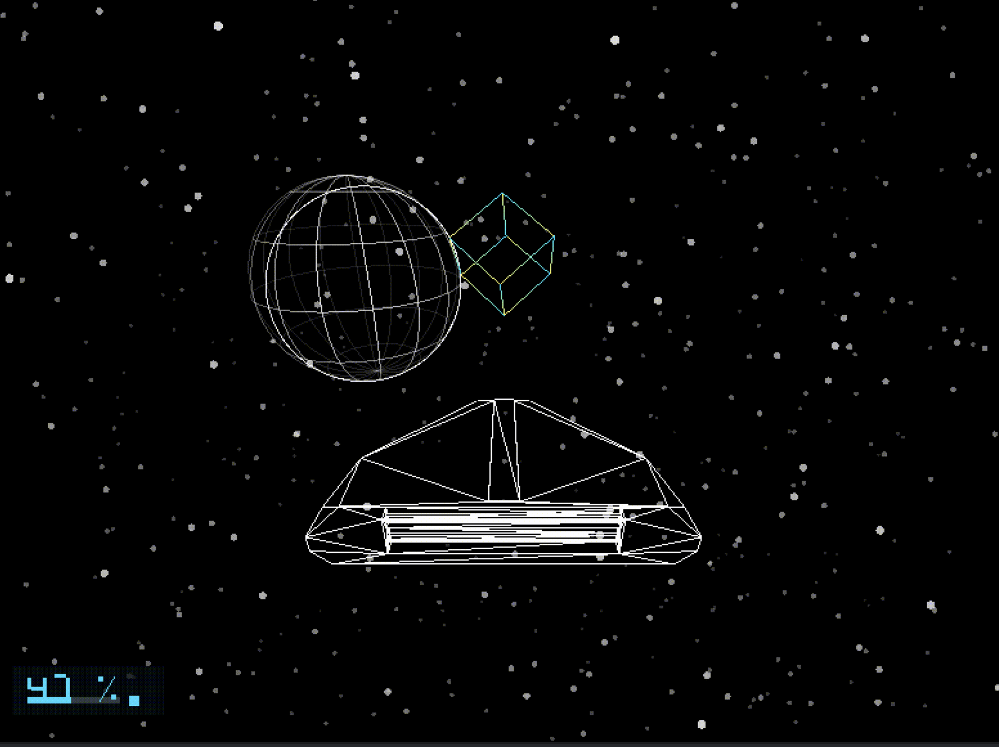

# dusk



`dusk` is a small SFML/C++ experiment that fakes 3D in a 2D window. There is no OpenGL, no depth buffer, no borrowed rendering pipeline underneath it — just a `Vec3` world, a hand-rolled camera and view matrix, a perspective projector, and SFML lines and shapes doing the actual drawing. Everything from vector math to frustum clipping to Newtonian ship physics is written from scratch, on purpose.

Pick PLAY, and you drop into a procedurally generated star system: a filled white sun, a handful of orbiting gridded planets, a spinning wireframe space station you can auto-dock with, and a scatter of NPC ships going about their own simple-reflex business — all seeded from one number. Open the galactic chart with `G` to pick any of the galaxy's 1000 systems and jump there, or the system map with `M` to see what's orbiting where.

## Manifesto

`dusk` is a spare-time side project with no deadline and no syllabus behind it. It exists to answer one question: how would a vector-graphics game in the spirit of *Elite* (1984) be built today — same wireframe soul, same "everything is lines," but with more modern C++ underneath?

The constraint that makes it interesting is that SFML is only allowed to draw primitives (lines, circles, rectangles). Every transform, every clip, every collision check, every bit of orbit and thrust math is engine code that lives in this repository. That trades away convenience for the chance to actually understand a 3D pipeline from the vertex up.

## What's Actually Working Right Now

- A main menu with keyboard and mouse input, and a showcase camera orbiting the ship.
- Scene management, with scenes owning their own world and requesting transitions.
- A single `Galaxy` of 1000 deterministically generated systems, built from one seed at startup — same seed, same galaxy, every time.
- One reused `SystemScene` that regenerates its entire world from a system's own seed the moment you enter it, so system #217 always looks and plays out the same way.
- Real orbital mechanics: planets orbit a central star under actual Newtonian gravity, integrated with velocity Verlet, and the star's own gravity pulls on the player ship too.
- An OBJ-modelled space station procedurally placed in orbit around a random planet, in systems that roll one. It spins Elite-style around its docking axis, with the slot facing along its orbit.
- A docking computer: press `C` and the ship flies itself to the station, lines up, matches the station's spin, and slides into the docking slot. Once docked, the station screen opens; launching backs the ship out, turns it around, and hands control back.
- Simple-reflex NPC ships that roam, avoid planets and stars, occasionally head to the station and dock, and periodically "warp out" and back in — no memory, no planning, just current-state reflexes.
- An "on-paper" economy and system-flavor layer: procedural system names, an economy tier, a dominant occupation, a handful of tradeable goods, and derived prices per system — generated, but not yet wired into any in-game trading UI.
- A camera that chases the ship from behind, plus an orbit "showcase" mode.
- A wireframe ship rendered from a vector model, with face culling and hidden-underside edges.
- OBJ loading, so you can swap the built-in ship for any triangulated wireframe model — the project ships with a `banshee.obj` model, used for both the player ship and every NPC ship.
- Velocity Verlet ship physics: real acceleration, real persistent velocity, and now real external gravity, all fed through the same integrator.
- Flight assist on top of that physics: throttle sets a speed, and the main engine, retro thrusters and RCS fire (within their own force limits) to hold it, so the ship's velocity follows the nose through a turn. Switch it off for the raw Newtonian model.
- Rate-controlled rotation: turn keys command a yaw/pitch rate that spins up smoothly and stops crisply, with a precision modifier for fine aiming.
- An in-system cruise drive for crossing systems that are now hundreds of thousands of units across, with Elite-style mass locking near planets, the star and the station.
- Planet-scale worlds: planets 20–70 ship-lengths in radius, a star bigger still, and orbits roughly 140,000 units apart.
- Asteroid belts in about 60% of systems: dense fields of tumbling wireframe rocks streamed around you from the belt's seed, orbiting the star at their real orbital speed, with a dust ring visible from across the system, and rocks you can actually hit.
- Little debris belts circling about one planet in five, carried along their planet's orbit.
- Lone rocks drifting through space around you wherever you fly, so the void between planets isn't empty.
- Object-level collision detection (ship, station, planets) using swept and static spherical volumes.
- A recycled, endless-feeling starfield.
- Frustum clipping for both points and line segments, with a small side guard-band so things don't visibly pop in at the frustum edges.
- A system's star drawn as a solid filled disc, and its planets drawn as gridded, optionally ringed wireframes — sorted and drawn back-to-front together, with per-edge visibility shading based on facing direction.
- Fuel with mass: a 6-tonne tank limits how far you can jump (40 LY full) and how long you can cruise (about ten minutes flat out), and every tonne aboard makes the ship slower to accelerate and to turn.
- A station screen while docked: refuelling at local prices with your credits, launch, and pages laid out for market, upgrades, missions and a garage.
- NPC ships that visibly dock: they line up on the slot, roll to match it and fly in, then launch back out of it later.
- One stylesheet (`include/ui/style.h++`) holding every colour in the game, so the whole look can be re-themed from a single file.
- An Elite-style flight HUD: a bottom dashboard with speed and throttle, a 3D scanner, heading, pitch and turn-rate readouts and a target compass; heading and pitch tapes; a boresight and prograde marker; and brackets (or an off-screen arrow) on the locked target.
- Target lock (`T`): the station can be locked, and shows on the scanner, the compass and in view with its distance and closing speed.
- A galactic chart of all 1000 systems laid out on a two-armed spiral, navigable by arrow keys or mouse, with zoom, pan, per-system details, and jumping.
- A system map: a top-down, to-scale view of the current system's orbits, with the station, traffic, your position, and a details panel for every body.

## Roadmap

Checked-off items are implemented today; everything else is a future direction, picked up whenever the mood strikes.

### Engine

- [x] C++/SFML projection and rendering system that fakes 3D rendering in 2D
- [x] Frustum clipping
- [x] Culling
- [x] Scene management
- [x] OBJ loader
- [x] Object-level collision detection
- [x] Integrator upgrade: velocity Verlet in place of explicit Euler
- [ ] Music and sound
- [ ] Rigid bodies

### Game

- [~] Procedural world generation
  - [x] Planets per system
  - [x] Systems (1000 generated per galaxy today)
  - [~] In-system and inter-system economy — prices compute per system, no trading UI yet
  - [x] Simple-reflex agent (S-RA) NPC ships
  - [ ] Missions
- [ ] End goal: reach the centre of the galaxy
- [~] Newtonian physics
  - [x] Ship thrust follows Newton's first law, integrated with velocity Verlet
  - [x] Objects act upon one another — the star and every planet exert real gravity on each other and on the ship
  - [x] Flight assist: velocity-holding thruster control, switchable back to raw Newtonian flight
  - [x] In-system cruise drive with mass locking
  - [ ] Towed cargo mass affects ship handling (every thruster already divides by `mass`, so this is mostly bookkeeping)
- [x] Phase-space warp between system nodes — a countdown, jump and hyperspace-tunnel sequence (see [Travel Animations](#travel-animations))
- [x] Galactic map
- [x] System map
- [ ] Spaceships
  - [ ] Chemical combustion ships
  - [ ] Electric ships
  - [ ] 20 ships total
- [x] World
  - [x] Asteroid belts
  - [x] OBJ-loaded models
  - [x] Stars
  - [x] Planets
- [ ] Dynamic S-RA economy driven by supply and demand
- [x] System economy tiers (Poor / Developing / Progressive)
- [x] Tradeable goods (silicon chips, food, liquor, wines, ores, electronics, furs, animals, books, chemical fuel)
- [x] World occupations (mining, engineering and tech, agricultural)
- [ ] Mission variety (live cargo transport, mining, bounty hunting, cargo transport, station defence/offence)
- [x] NPC interactions — NPC ships roam, dock, and warp on their own; nothing talks to the player yet
- [ ] HUD
  - [x] Thrust
  - [x] Relative velocity/pitch/yaw
  - [x] Targeting, radar-esque (station only so far)
- [~] Physics
  - [x] Object-level collision hitboxes
  - [x] Fuel expenditure (mass matters)
- [~] Upgrades (docking computers, guns, scanners, fuel tanks, jump drives, mining gear) — the docking computer exists, fitted as standard for now
- [~] Docking — automatic docking and launch work, NPCs dock and launch visibly, and the station screen offers refuelling; manual docking is next
- [~] Space stations: small, medium, large — one procedurally placed small station (`station_s.obj`) per eligible system today
- [x] Wireframe graphics style
- [x] Animations
- [ ] Classical music for docking (*The Blue Danube*, for example)

P.S. I wanted to add something that breathes life without the player on the small scale — a system that reacts to itself almost on a clock, running in the background so the procedural world feels alive even when nobody is watching it.

## Build

Requirements:

- CMake 4.3 or newer, matching the current `CMakeLists.txt`.
- A C++23 compiler.
- SFML 3 with the Graphics, Window, and System components.

Configure and build:

```sh
cmake -S . -B build
cmake --build build
```

Run:

```sh
./build/dusk
```

Game assets (fonts, OBJ ship models) are copied into the build directory automatically from `assets/`.

## Controls

The main menu accepts:

- `Enter` or `Space`: start the first test scene.
- Mouse click on `PLAY`: start the first test scene.
- Mouse click on `EXIT`, or `Escape`: quit.

Playable scenes use a ship-first input pipeline:

```text
keyboard -> ship controls -> ship physics -> camera follows ship -> render
```

Flight controls:

- `W`: increase throttle.
- `S`: decrease throttle.
- `X`: cut throttle to `0` (with flight assist on, the ship brakes to a stop).
- `Arrow Down`: toggle forward/reverse and reset throttle to `0`.
- `A`: yaw ship left.
- `D`: yaw ship right.
- `Q`: pitch nose up.
- `E`: pitch nose down.
- `Shift` (hold): precision turning, about a third of the normal turn rate.
- `F`: toggle flight assist.
- `J`: charge the cruise drive (it engages after 1.2 s; press again to cancel), or drop out of cruise. Refused while mass-locked.
- `Arrow Up`: hold to orbit the camera around the ship (showcase mode) instead of chasing it.
- `Escape`: quit.

Once you're in a system:

- `G`: open the galactic chart.
- `M`: open the system map.
- `T`: lock or clear the target (the station is the only target for now).
- `C`: engage the docking computer. Press again during the approach or line-up to cancel; once the ship starts entering the slot the sequence is committed. Engaging it also locks the station as your target.

On the galactic chart:

- Arrow keys step to the nearest system in that direction; a mouse click selects; hovering shows a system's name.
- Mouse wheel or `+`/`-` zooms; dragging pans; `H` returns to your current system.
- `Enter`, `Space` or the `JUMP` button starts a hyperspace jump to the selected system: a 5-second countdown (you can keep flying; `Escape` aborts it), then the jump itself. Jumping is unavailable while docked, while the docking computer is flying, or while another jump is under way.
- `G` or `Escape` closes the chart.

On the system map:

- `Up`/`Down` (or a click on a body or a row in the list) highlights a body and shows its details.
- `T` locks the station, `G` switches to the galactic chart, `M` or `Escape` closes the map.

While a map is open, flight controls are paused (the ship carries on under flight assist) and `Escape` closes the map instead of quitting.

While docked:

- The station screen opens automatically. Services are listed on the left: REFUEL, MARKET, UPGRADES, MISSIONS, GARAGE (the middle three marked SOON for now) and LAUNCH.
- `Up`/`Down` (or `W`/`S`, `Tab`) choose a service. `Enter`/`Space` does the page's main action: fill the tank on REFUEL, launch on LAUNCH.
- On REFUEL, `B` buys one tonne.
- `L` launches from any page, and `Escape` closes the screen (you stay docked). The mouse works throughout.
- With the screen closed: `Enter` reopens it, `L` launches.

With flight assist on (the default), throttle is a speed demand: `W`/`S` choose how fast you want to go along the nose, and the thrusters get you there and hold it. Turning swings your velocity round with the nose, because the RCS cancels the sideways drift. `X` (or throttle to `0`) brings the ship to a stop; `Arrow Down` then lets you back up slowly.

With flight assist off (`F`), movement is purely velocity-based, as before: throttle is a fraction of main-engine thrust, easing off it only stops adding acceleration, and the ship keeps drifting on whatever velocity it built up. To brake in that mode, tap `Arrow Down` to switch to reverse thrust, hold `W`, and ease off near a stop.

To cross a system, fly clear of the nearest planet, star or station until the readout stops saying `MASS LOCKED`, then press `J` and let the drive charge. Cruise speed follows throttle up to 30,000 units per second, tapers off automatically as you approach a body, and drops out at its mass-lock boundary near normal-space top speed. The HUD's prograde ring shows where you are actually travelling: put it on a target to fly straight at it.

## Project Layout

```text
src/
  main.cpp

include/
  io/
    obj_loader.h++

  math/
    Vec2.h++
    Vec3.h++
    Mat4.h++
    verlet.h++

  model/
    vector_model.h++

  objects/
    ship.h++
    npc_ship.h++
    cube.h++            (the Station type and its docking port)
    planet.h++
    asteroid.h++
    commander.h++
    star.h++
    collision_body.h++

  procgen/
    statistical.h++
    galaxy.h++
    planet_generation.h++
    asteroid_generation.h++

  scenes/
    scene.h++
    scene_manager.h++
    main_menu.h++
    system_scene.h++
    default_scene.h++

  systems/
    ship_physics.h++
    travel_effects.h++
    refuelling.h++
    orbital_physics.h++
    npc_ai.h++
    docking_computer.h++
    economy.h++

  tools/
    camera.h++
    camera_controller.h++
    ship_controller.h++

  world/
    world.h++
    starfield.h++

  ui/
    style.h++
    station_menu.h++
    menu_button.h++
    format.h++
    galaxy_map.h++
    system_map.h++

  rendering/
    projector.h++
    star_renderer.h++
    planet_renderer.h++
    asteroid_renderer.h++
    travel_effects_renderer.h++
    station_renderer.h++
    ship_renderer.h++
    hud_renderer.h++

assets/
  fonts/
    Jersey15-Regular.ttf
  objects/
    ships/
      banshee.obj
    stations/
      station_s.obj
```

The important separation is:

- `objects/`: data and local per-object helper functions: `Ship`, `NpcShip`, `Planet` (also used for the star), `Station` (in `cube.h++`, a name kept from when the station was a test cube), `Star`, `Asteroid`/`AsteroidBelt`, `CollisionBody`.
- `model/`: the shared wire/vector model format used by anything drawn as lines and faces.
- `io/`: file loading and conversion, currently OBJ-to-vector-model.
- `procgen/`: deterministic, seed-in/data-out generation — galaxy roster, per-system flavor text and stats, and the star/planet/station/spawn placement that builds an actual `World` from that data.
- `scenes/`: the scene interface, active-scene ownership, and the concrete scene presets.
- `systems/`: simulation logic that isn't tied to any one object type — ship physics, orbital physics, NPC AI, and economy pricing.
- `tools/`: input handling and camera behavior.
- `world/`: ownership and per-frame updates of everything that exists in world coordinates, including collision detection.
- `rendering/`: code that turns world/camera state into pixels.
- `ui/`: screen-space interface pieces — the stylesheet, buttons, text formatting, the galactic chart and the system map.
- `src/main.cpp`: orchestration only — it should stay boring.

`main.cpp` stays deliberately boring: it owns the window, the camera, the scene manager and the renderers, and runs the frame loop. Everything interesting happens inside the active scene or the systems it calls.

## A Frame, Start To Finish

Every frame runs the same fixed sequence. Knowing it makes it much easier to see where a new feature belongs.

1. **Frame time.** `dt` is the time since the last frame, capped at 0.1 s. A stalled frame (dragging the window, a breakpoint) is simply lost, instead of being simulated in one enormous step that would fling ships and planets.
2. **Events.** Every queued SFML event is handled:
   - closing the window quits;
   - `Escape` quits unless the scene `capturesEscape()` (it does while a map is open or a hyperspace countdown is running);
   - every event is then passed to `Scene::handleEvent()`, which is where the maps, target lock, docking computer and station screen react to key presses and mouse clicks.
3. **Transitions.** If the scene asked for one (PLAY or EXIT on the menu), `applySceneTransition()` swaps scenes and resets the input and camera state that lives in `main.cpp`.
4. **Ship input.** If `acceptsShipInput()` is true, `updateShipFromKeyboard()` turns held keys into pilot intent on the ship: throttle, yaw and pitch demands, the precision modifier, and the reverse, flight-assist and cruise toggles. It never moves the ship itself. The scene returns false while a map is open, while the docking computer flies, and during a hyperspace jump.
5. **Physics, in sub-steps.** The frame's `dt` is split into equal steps of at most 1/120 s, and `Scene::updatePhysics()` runs once per step. This keeps the flight computer, the integrators and the camera spring behaving the same at 30 or 144 frames per second. For `SystemScene`, one step is:
   1. `updateWorldPhysics()`, in the order listed under [One Physics Step](#one-physics-step);
   2. `docking::update()`, which moves the player kinematically while the docking computer is in control;
   3. the cruise animation timers (engage burst, drop-out flash);
   4. the hyperspace sequence, which may swap in a new system mid-tunnel.
6. **Camera.** `Scene::updateCamera()` runs once per frame with the full `dt`. The chase camera reads the ship's position, orientation and acceleration, runs its spring, and sets the field of view. The scene adds its own FOV offset during a jump.
7. **Streaming.** `updateStreaming()` re-wraps the starfield around the camera's new position.
8. **Drawing,** back to front, because there is no depth buffer:
   1. clear to `style::background`;
   2. background stars;
   3. the star and planets, sorted far to near;
   4. asteroid dust and rocks;
   5. the station;
   6. the player's ship and visible NPC ships;
   7. travel effects (streaks, bursts, the hyperspace tunnel);
   8. the HUD, if `showsHud()`;
   9. the scene's screen-space overlay: the system name, hints, messages, the station screen, a map, or the hyperspace text.

### One Physics Step

`updateWorldPhysics()` in `include/world/world.h++` runs in this order, and the order matters:

1. **Clock.** `elapsedTime` advances. It is a double, and drives belt rotation and rock tumbling.
2. **Mass lock.** The player's `cruiseMargin` is refreshed from the nearest star, planet or station, even under autopilot, so the HUD always knows whether cruise is available.
3. **Player ship** (unless the docking computer has control). Gravity is summed from the star and planets. `integrateShipPhysics()` then runs rotation, the cruise charge, and either cruise or flight-assisted Newtonian motion. Finally `resolveShipBodyContact()` keeps the ship outside planets and the star.
4. **Planets.** One N-body step: every planet pulls on every other, and the star pulls on all of them.
5. **Belts.** Each belt moves to its star or host planet and turns to its orbital angle.
6. **Drifting rocks.** They move, are recycled if out of range, and are topped up to 40.
7. **Rock contacts.** The player is pushed out of any belt or drifting rock it overlaps, with the planets and belts now in their final positions for this step.
8. **Station.** It moves along its orbit around its (already moved) host.
9. **NPCs.** Each NPC runs its simple-reflex AI and integrates through the same `integrateShipPhysics()` as the player.
10. **Station spin.**
11. **Collision detection.** Hits are recorded on every `CollisionBody` for anything that wants to query them.

Everything that moves something lives in this function, the systems it calls, or the docking computer. Renderers, the HUD and the camera only read.

## The World Coordinate Model

Everything exists in world coordinates as `Vec3` values:

```cpp
struct Vec3 {
    float x = 0.f, y = 0.f, z = 0.f;
};
```

The convention used throughout the project is:

- `+x`: right.
- `+y`: up.
- `+z`: forward.

Each scene owns a `World` (`include/world/world.h++`), which holds everything that exists in a system:

```cpp
struct World {
    Starfield starfield;                       // the wrapping background star pool
    Station station;                           // the system's station (if stationActive)
    bool stationActive = true;
    std::vector<Planet> planets;
    std::vector<NpcShip> npcShips;
    std::mt19937 npcRng;                       // NPC spawn/behaviour randomness
    float systemOuterRadius = 40000.f;         // how far out NPCs roam

    Planet star;                               // the central star; never moved by orbital physics

    int stationHostPlanetIndex = -1;           // which planet the station orbits, and how
    float stationOrbitRadius = 0.f;
    float stationOrbitAngle = 0.f;
    float stationOrbitSpeed = 0.15f;

    Ship playerShip;
    TargetLock target;                         // what the player has locked (station or nothing)

    std::vector<AsteroidBelt> asteroidBelts;   // the star's belts, then planets' debris belts
    std::vector<Asteroid> driftingAsteroids;   // lone rocks kept around the player
    std::vector<AsteroidShape> looseRockShapes;
    int looseCoarseShapeCount = 0;
    std::mt19937 driftRng;

    double elapsedTime = 0.0;                  // simulated seconds in this system
};
```

The star reuses the `Planet` type with `isStar` set, rather than being its own struct: it needs the same position, mass and radius fields planets already have. The renderer, the gravity code and the contact code just check that one flag when a body needs star-specific treatment.

### Units And Scale

World units are abstract (they aren't metres), but the proportions are fixed, and most tuning numbers only make sense against them:

| Thing | Size |
| --- | --- |
| Player ship (and NPCs) | about 500 units long |
| Small station | about 1,300 units across |
| Asteroids | 70–1,100 units in radius, the odd giant up to 2,600 |
| Planets | 10,000–34,000 units in radius |
| Star | 45,000–80,000 units in radius |
| Orbital shells | about 140,000 units apart, the outermost planet roughly 600,000 out |
| Normal-space top speed | 1,200 u/s |
| Cruise top speed | 30,000 u/s |

Everything stays within about a million units of the origin, where 32-bit floats still resolve positions to a few hundredths of a unit, so nothing jitters on screen.

The ship is just another object living in world coordinates. The camera follows it, but the ship doesn't "belong" to the camera — that relationship only exists in the camera-controller code:

```text
Ship has world position and velocity.
Camera chooses a world position behind/up from the ship.
Renderer transforms world positions into camera space.
Projector turns camera space into screen pixels.
```

`main.cpp` never constructs world objects directly. It asks the scene manager for the active scene, and the scene owns everything from there:

```cpp
SceneManager sceneManager;
sceneManager.setScene<MainMenuScene>();
World& world = sceneManager.world();
```

## How Fake 3D Rendering Works

There's no OpenGL, no depth buffer, no real 3D meshes on the GPU. `dusk` keeps 3D coordinates on the CPU and manually projects them onto a 2D SFML window every frame. All of this lives in `include/rendering/projector.h++`.

Projection happens in two broad steps:

1. Convert a point from world space into camera space.
2. Convert camera space into screen space.

### World Space To Camera Space

World space is the shared coordinate system everything lives in. Camera space is the same coordinates re-expressed from the camera's point of view:

- The camera sits at the origin.
- `+z` is in front of the camera.
- `+x` is right on screen.
- `+y` is up on screen.

The camera builds a view matrix from an orthonormal basis of its own right/up/forward vectors:

```cpp
Mat4 createViewMatrix(const Camera& camera) const;
```

A world point is transformed into camera space with:

```cpp
Vec3 cameraSpace = transformPoint(viewMatrix, worldPosition);
```

The view matrix folds in the camera's position too, so the result is already relative to the camera, roll included.

### Camera Space To Screen Space

Once a point is in camera space, perspective projection is a straightforward divide:

```text
screenX = centerX + cameraX * focalLength / cameraZ
screenY = centerY - cameraY * focalLength / cameraZ
```

`cameraZ` is depth. As depth grows, the division makes things shrink toward the center of the screen — the usual perspective illusion. Focal length comes from the vertical field of view:

```text
focalLength = viewportHeight * 0.5 / tan(fov * 0.5)
```

A narrow FOV gives a larger focal length and feels more zoomed in; a wide FOV gives a smaller one and feels more zoomed out.

### Frustum Clipping

The frustum is the visible pyramid of space in front of the camera:

```cpp
struct Frustum {
    float nearPlane;
    float farPlane;
    float halfVerticalFovTan;
    float aspect;
};
```

For a single point, clipping just checks whether `z` sits between the near and far planes, and whether `x`/`y` sit inside the FOV cone at that depth. For a line — cube edges, ship edges, planet grid segments — the projector clips the whole segment against all six frustum planes before projecting either endpoint, using a Liang–Barsky-style parametric clip in `clipLineCameraSpace`. This avoids the visual glitches you'd get from projecting a point that's behind the camera or wildly outside the FOV.

`ProjectionConfig::sideGuardBand` pads the horizontal/vertical FOV slightly during clipping, so objects don't visibly pop in and out right at the screen edge.

### Face Culling

There is no depth buffer, so a wireframe would normally show every edge, including the ones on the far side of the hull. Hidden-line removal fixes that, one convex-ish model at a time.

`Projector::isFrontFacing()` takes a triangle's three camera-space vertices and computes its normal from the winding (`cross(b − a, c − a)`). The triangle faces the camera when that normal points back toward the camera, the origin of camera space. OBJ faces are expected to be wound outward; the loader flips the winding when an import transform mirrors the model.

The ship and station renderers then sort edges into two sets:

- every edge that belongs to some face;
- the edges of faces that currently face the camera.

A line is drawn if it is in the second set, or if it isn't a face edge at all (decorative detail lines, or every line of a model with no faces). In other words, an edge disappears only when every face it borders points away from you. Silhouette edges, which border one front face and one back face, always survive.

Asteroids use the same rule with their own outward-wound shapes. Because each rock is roughly convex, this gives correct hidden lines for a single rock, but nearer rocks don't hide farther ones; nothing hides anything else in this engine.

## The Ship

Ship state lives in `include/objects/ship.h++` (abridged):

```cpp
struct Ship {
    Vec3 position;
    Vec3 previousPosition;
    Vec3 velocity;
    CollisionBody collision;
    float collisionRadius = 140.f;

    float yaw;
    float pitch;
    float roll;                         // docking computer only
    float throttle;                     // speed demand with flight assist, thrust fraction without
    bool reverseThrust;

    // Mass and fuel: thrusters divide by the TOTAL mass (hull + fuel + cargo)
    float mass = 15.f;                  // dry hull
    float fuelCapacity = 6.f;           // tonnes
    float fuel = 6.f;
    float hyperspaceFuelPerLightYear = 0.15f;  // 40 LY on a full tank
    float cruiseFuelPerSecond = 0.01f;  // at full cruise speed
    bool usesFuel = true;               // false for NPCs
    float cargoMass = 0.f;              // reserved for trading

    // Linear flight model: acceleration = force / total mass
    float maxThrust = 1260.f;           // main engine: 70 u/s^2 at half a tank
    float retroThrust = 1620.f;         // braking and reverse: 90 u/s^2 at half a tank
    float lateralThrust = 3600.f;       // RCS: 200 u/s^2 at half a tank, cancels sideways drift
    bool flightAssist = true;
    float maxSpeed = 1200.f;
    float reverseSpeedFraction = 0.35f;
    float assistResponseTime = 0.3f;
    float throttleChangeSpeed = 0.5f;

    // Rotation: input commands a rate, the ship eases toward it
    float yawSpeed = 1.35f;             // max rates, rad/s
    float pitchSpeed = 1.35f;
    float yawRate, pitchRate;           // current angular velocity
    float turnResponseTime = 0.12f;     // spin-up
    float turnStopTime = 0.05f;         // stop on release
    float precisionTurnScale = 0.35f;
    float yawInput, pitchInput;         // pilot intent in [-1, 1]
    bool precisionInput;

    // Cruise drive
    bool cruiseEngaged;
    float cruiseMaxSpeed = 30000.f;
    float cruiseAcceleration = 2500.f;
    float cruiseDeceleration = 9000.f;
    float cruiseSlowdownRate = 0.5f;
    float cruiseMargin;                 // refreshed by World; <= 0 means mass-locked

    VectorModel model = createDefaultShipModel();
};
```

These are the knobs to turn if the handling needs adjusting (the forces are tuned for a ship carrying half a tank; see [Fuel And Mass](#fuel-and-mass)): `maxThrust` for how hard the ship pulls in a straight line, `lateralThrust` for how quickly it carves a turn, `maxSpeed` for top speed, and `yawSpeed`/`pitchSpeed` with the two time constants for how the nose feels.

Orientation helpers keep physics and rendering agreeing about which way the ship is pointing:

```cpp
Vec3 shipForward(const Ship& ship);
Vec3 shipRight(const Ship& ship);
Vec3 shipUp(const Ship& ship);
Vec3 shipLocalToWorld(const Ship& ship, const Vec3& local);
```

If no OBJ is loaded, the ship falls back to a small built-in Sidewinder-inspired vector model (`createDefaultShipModel()`). In practice, every `Ship` in the game — the player's and every `NpcShip`'s alike — loads `assets/objects/ships/banshee.obj` on entry to a system, each with its own corrective `ObjLoadOptions` rotation, since the source model wasn't authored nose-forward along `+z`. `NpcShip` (`include/objects/npc_ship.h++`) just wraps a `Ship` with a small AI state machine bolted on top, which is exactly why NPCs get the same model, the same physics, and the same renderer as the player for free.

## Ship Physics

Physics lives in `include/systems/ship_physics.h++`, and the underlying integrator lives in `include/math/verlet.h++`.

Every force on the ship is still divided by mass and fed through velocity Verlet; what changed is how the thrust force is chosen.

With **flight assist** on, throttle becomes a signed speed demand along the nose (`shipTargetSpeed()`). Each step, `flightAssistThrustForce()` works out the acceleration that would close the gap between the current velocity and that demand over `assistResponseTime`, subtracts external acceleration so gravity is cancelled, and splits the result along the ship's forward, right and up axes. Each part is then clamped to what the hardware can do: forward against `maxThrust` and `retroThrust`, and the two sideways parts together against one shared `lateralThrust` budget. Large errors are therefore thrust-limited (the ship visibly works to change direction), and small ones settle smoothly. Because the error is never closed by more than one step's worth, a long frame can't overshoot.

With flight assist **off**, `manualThrustForce()` is the original model: throttle times `maxThrust` (or `retroThrust` in reverse) along the nose, and nothing else.

```cpp
inline Vec3 shipAcceleration(const Ship& ship, float dt = 0.f, const Vec3& externalAcceleration = {})
{
    if (ship.mass <= 0.f)
        return externalAcceleration;

    return shipThrustForce(ship, dt, externalAcceleration) / ship.mass + externalAcceleration;
}
```

**Rotation** is integrated in the same step. Input writes `yawInput`/`pitchInput`; `integrateShipRotation()` eases the actual rates toward `input × maxRate` with an exponential response (`turnResponseTime` spinning up, the shorter `turnStopTime` slowing down), then advances yaw and pitch. A 50 ms tap moves the nose about 2°, or about 0.7° with `Shift` held. NPCs and the docking computer still set yaw and pitch directly and leave the inputs at zero.

**Cruise** is deliberately not Newtonian. While engaged, `integrateCruise()` sets speed along the nose, chasing `throttle × cruiseMaxSpeed` but hard-capped by `cruiseSpeedLimit()`: `maxSpeed + cruiseSlowdownRate × cruiseMargin`. `cruiseMargin` is the distance to the nearest mass-lock boundary (`cruiseMarginAt()` in `world.h++`: half a body's radius plus 5000 units above its surface, or 12000 units from the station). Heading straight at a planet, the cap shrinks with the distance, so speed decays smoothly and the drive drops out at the boundary at normal-space top speed. `disengageCruise()` clamps speed to `maxSpeed` and re-points throttle at it, so flight assist carries on instead of braking.

```cpp
inline void integrateShipPhysics(Ship& ship, float dt, const Vec3& externalAcceleration = {})
{
    ship.previousPosition = ship.position;
    integrateShipRotation(ship, dt);

    if (ship.cruiseEngaged && shipMassLocked(ship))
        disengageCruise(ship);

    if (ship.cruiseEngaged)
    {
        integrateCruise(ship, dt);
        return;
    }

    const Vec3 acceleration = shipAcceleration(ship, dt, externalAcceleration);
    ship.position = verlet::position_update(ship.position, ship.velocity, acceleration, dt);
    ship.velocity = verlet::velocity_update(ship.velocity, acceleration, acceleration, dt);
}
```

`main.cpp` runs physics in sub-steps of at most 1/120 s and caps a single frame at 0.1 s, so the flight computer and the integrators behave the same at any frame rate and a stalled frame can't fling anything.

`World` computes that external acceleration once per frame via `gravityOnShip()`, which sums `orbital::gravitationalAcceleration()` contributions from the star and every planet at the ship's current position, and hands it straight to `integrateShipPhysics()`. NPC ships go through the same function with their own local gravity sample, so the player and every NPC share one physics code path.

`verlet::position_update` and `verlet::velocity_update` are small, reusable, and not ship-specific — they only need a displacement/velocity/acceleration and a timestep, which is exactly why `orbital_physics.h++` reuses them directly for planet motion instead of writing a second integrator.

There is still no drag. With flight assist off, the ship keeps its velocity until thrust (or gravity) changes it; with it on, the thrusters are what slow it down.

`ship.previousPosition` is also what makes swept collision detection possible: it's the "where was I a moment ago" needed to catch a fast-moving ship that tunnels through a thin collision volume between frames.

## Collision Detection

Dusk separates **detection**, which records that two things touch, from **response**, which actually stops the ship going through something. Responses are the ones that matter in play today.

### Responses

These run inside `updateWorldPhysics()` and move the ship:

- **`resolveShipBodyContact()`.** If the ship (player or visible NPC) has sunk into a planet or the star, it is moved back to the surface along the line from the body's centre. It then loses the part of its velocity, relative to that body, that points inward, and drops out of cruise. That lets you skim a planet but never fly through it. The menu scene's placeholder star isn't a real star (`isStar` is false), so it is never solid.
- **`resolveShipRockContact()`,** called for every belt rock and drifting rock within reach by `resolveShipAsteroidContact()`. It does the same against a rock, treated as a sphere at 85% of its jagged radius so grazing a spike doesn't snag. Velocity is taken relative to the rock, so a passing belt rock shoves you along with it. Rocks are treated as far heavier than the ship, so they never move.

The station has no contact response. The docking computer flies the ship in and out of it, and ships are expected to stay out of its way otherwise.

### Detection

Detection lives in `include/objects/collision_body.h++` and is wired together in `updateWorldCollisions()` at the end of every physics step. Every collidable object carries a `CollisionBody`:

```cpp
struct CollisionBody {
    bool detectsCollisions = true;
    std::vector<CollisionHit> hits;
};
```

Each `CollisionHit` records:

- the kind of object touched (`CollisionObjectType::Ship`, `::Cube` — which means the station, a name kept from when it was a test cube — or `::Planet`);
- an index (for collections like `planets`);
- a unit normal pointing from this object toward the other;
- how far the two volumes overlap.

Each step, `updateWorldCollisions()`:

1. clears every object's hits from the last step;
2. runs a **swept sphere** test for the player ship against the station and against every planet. It's swept because the ship can move far enough in one step that a plain overlap test would miss it passing straight through something; the sphere runs from `previousPosition` to `position`;
3. runs plain **sphere-sphere** tests between the station and each planet, and between every pair of planets;
4. registers each hit symmetrically on both objects involved.

The station's generated `CollisionBody` has `detectsCollisions = false`, so it never registers hits. NPC ships and asteroids don't carry `CollisionBody`s and aren't part of detection; NPCs steer around bodies through their own AI. The recorded hits are there for gameplay to query (`isColliding()`, `collidingWith(type)`, `collidingWith(type, index)`), for example damage or proximity warnings later. Nothing reads them yet.

## Orbital Physics And Gravity

Orbital mechanics live in `include/systems/orbital_physics.h++`, under the `orbital` namespace, and reuse the same `verlet::` integrator functions as ship physics.

Gravity between any two bodies is a simple inverse-square pull, with a softening floor so it doesn't spike toward infinity at very close range:

```cpp
constexpr float g = 100.f;          // tuned for this project's world-unit scale, not SI units
constexpr float minDistance = 250.f;

inline Vec3 gravitationalAcceleration(const Vec3& from, const Vec3& toward, float towardMass)
{
    const Vec3 offset = toward - from;
    const float distance = std::max(length(offset), minDistance);
    const float accelerationMagnitude = g * towardMass / (distance * distance);
    return normalized(offset) * accelerationMagnitude;
}
```

Every physics tick, `World::updateWorldPhysics()` calls `orbital::integrateOrbitalPhysics()`, which sums gravity on each planet from the (fixed) star and every other planet, then advances every planet's position and velocity with velocity Verlet — a real, if small-scale, N-body simulation, not a scripted orbit path. The star itself never moves or accelerates; it's the one fixed anchor everything else orbits.

The same `gravitationalAcceleration()` function is what `World::gravityOnShip()` uses to work out how hard the star and planets are currently pulling on the player, and it's what `npc_ai::updateNpcShip()` samples for each NPC before calling the shared `integrateShipPhysics()`. One gravity function, three different things being pulled around by it.

Masses are set in `planet_generation.h++`. A star's mass is `750 × radius`, which puts first-shell planets on orbits of about 140–180 units per second (slow enough for the docking computer to chase a station down) and gives the star a surface pull of roughly 1 u/s². A planet's mass is `0.0005 × radius²`, keeping each one at about 0.5–2% of its star's mass so the N-body orbits stay well-behaved (radius drift of a few percent over two simulated hours) rather than planets tugging each other out of their shells. Flight assist cancels gravity automatically; with it off, the star's pull is noticeable over a minute or so.

`circularOrbitVelocity()` is the other half of the picture — given a position, a center, and a central mass, it returns the tangential velocity needed for a (roughly) circular orbit at that distance. Procedural planet generation uses it to hand every new planet a starting velocity that won't immediately spiral it into the star or fling it out of the system.

## Procedural Galaxy Generation

Procedural generation lives in `include/procgen/`, split across three files with very different jobs:

- `statistical.h++` generates the cheap, "on-paper" facts about a system — a pronounceable procedural name, an `EconomyTier` (Poor/Developing/Progressive, weighted toward Poor), a dominant occupation, 2–4 goods it best sells, and rolled counts for planets, stations, NPC ships and asteroid belts. NPC counts are then scaled by `npcTrafficMultiplier` (currently 3.0, i.e. triple the base traffic); because counts are small whole numbers, the fractional ship is settled by a dice roll drawn after every other roll, so the galaxy-wide average rises by exactly that factor without changing anything else about any system. All of this is packed into a `SystemInfo` and is cheap enough to generate and hold 1000 of at once, up front.
- `galaxy.h++` derives a stable per-system seed from one galaxy seed plus a system index (`deriveSystemSeed()`), and calls `generateSystemInfo()` for every system to build the full `Galaxy` roster.
- `planet_generation.h++` is where a `SystemInfo` actually becomes a playable `World`: it builds the star, places planets in outward, non-overlapping orbital shells with a real circular-orbit starting velocity, optionally places a station in orbit around a random planet, and works out a spawn pose (`shipSpawnPose()`): a few kilometres out from the station, facing it with its host planet filling the view behind, or facing the innermost planet in systems with no station.

The key idea holding this together is **determinism**: `generateGalaxy(seed)` always produces the same 1000 `SystemInfo` entries for the same seed, and `deriveSystemSeed(seed, systemIndex)` always produces the same per-system seed — so `SystemScene::enterSystem(217)` rebuilds the exact same system every single time you visit it, without anything needing to be saved to disk.

`main.cpp` builds the one `Galaxy` for the whole run:

```cpp
Galaxy galaxy = generateGalaxy(1337u); // TODO: seed from a save file or menu input later
```

## Stations

`Station` lives in `include/objects/cube.h++` (the file name is a leftover from when the station was a test cube). `procgen::generateStationPlacement()` picks a random host planet and rolls an orbit radius, angle, and speed; `SystemScene::enterSystem()` then loads `assets/objects/stations/station_s.obj` into the station and marks its docking slot. `World::updateStationOrbit()` moves the station around its host every physics tick — the host is itself moving under orbital physics — and keeps `station.dockFacing` pointing along the orbit.

Instead of tumbling on Euler angles, a station has an explicit orientation basis (`axisX`/`axisY`/`axisZ`). `refreshStationOrientation()` rebuilds it every frame in two steps: rotate the model so its docking normal points along `dockFacing`, then spin it around that axis by `spinAngle`. That is the classic *Elite* arrangement — the slot stays put while the station turns around it — and it is what makes docking possible. `stationLocalToWorld()` is what the renderer and the docking computer use to place model points in the world.

### The Docking Port

`DockingPort` describes the slot in model space: the centre of the opening (`mouth`), the centre of its back wall (`back`), the outward `normal`, the long side of the slot (`slotAxis`), and its `depth`. It's built from vertex indices by `configureDockingPort()`. For `station_s.obj`, vertices 1–16 (0-based 0–15) outline the slot: the even ring sits on the hull, and the odd ring is the same outline two model units deeper. If you export a new station model, find the equivalent rings and pass their indices in `enterSystem()`.

## Docking Computer

`include/systems/docking_computer.h++` holds a `DockingComputer` state machine, driven by `SystemScene`:

```text
Idle -> Approach -> Align -> Enter -> Docked -> LaunchReverse -> LaunchTurn -> Idle
          |           |
          +-----------+--> Disengage -> Idle   (cancelled with C)
```

While it's active, `SystemScene::acceptsShipInput()` returns `false` and `updatePhysics()` calls `updateWorldPhysics(world, dt, false)` so the player ship skips normal integration; `docking::update()` then positions the ship itself. The flight is kinematic — the docking computer places the ship rather than thrusting it — which keeps it smooth and reliable while the target is orbiting a moving planet.

- **Approach** flies to a point 1600 units in front of the slot. Far out, it heads straight there; within a few thousand units it blends in the approach point's own velocity, so it can keep pace with the orbiting station. The velocity *relative* to that point is kept as persistent state and smoothed — recomputing it from the ship's velocity each frame would let the station's centripetal acceleration show up as a constant lag. The path avoids the star, planets and the station hull (a detour waypoint for whatever is in the way, plus local steering away from nearby surfaces), and the speed drops near surfaces so the ship has room to turn.
- **Align** holds the ship on the approach point, points the nose down the slot, and rolls the ship to match the slot's long side. The ship's new `roll` field exists for this; player controls leave it at zero.
- **Enter** slides the ship down the slot axis, still matching the station's spin, until the nose is 10 units from the back wall.
- **Docked** keeps the ship parked in the slot and opens the station screen (see [Station Services](#station-services)).
- **LaunchReverse** backs the ship straight out to 900 units, **LaunchTurn** turns it to face away and levels the wings, and control returns with the ship moving at the station's speed plus 300 units per second outward.

The station screen is a `StationMenu` (`include/ui/station_menu.h++`), drawn from `SystemScene::drawOverlay()`; its buttons use the helpers in `include/ui/menu_button.h++`, which the main menu shares.

## NPC Ships And Simple-Reflex AI

NPC ship data lives in `include/objects/npc_ship.h++`; the behavior lives in `include/systems/npc_ai.h++`, under the `npc_ai` namespace.

An `NpcShip` is just a `Ship` (so it gets the exact same model, physics, and renderer as the player) plus a small state machine on top:

```cpp
enum class NpcState {
    Inactive,          // warped out, invisible, waiting to respawn
    Roaming,           // flying toward a roam waypoint, avoiding hazards
    HeadingToStation,  // flying to the approach point in front of the station's slot
    EnteringStation,   // lined up on the slot, flying down its axis into the station
    Docked,            // inside the station, invisible
    Launching,         // flying out of the slot along its axis
    WarpingOut         // brief wind-up before vanishing
};
```

This is a **simple-reflex agent** in the classical AI sense: `npc_ai::desiredDirection()` decides where to steer purely from the NPC's current position and its immediate surroundings — seek the current target, and blend in an avoidance vector away from any body (star or planet) it's currently too close to, with avoidance dominating the moment a hazard gets near. There's no path planning and no memory of anything beyond the current target; the same inputs always produce the same steering decision.

Each tick, `npc_ai::updateNpcShip()`:

1. Advances a per-NPC state timer.
2. While `Inactive`, waits out a randomized `wakeDelay` before respawning the NPC at a safe point via `respawnNpc()` (the "warp in").
3. While `Roaming` or `HeadingToStation`, computes a steering direction, turns the ship toward it at a limited rate (`steerToward()`), engages the cruise drive for any leg longer than 40,000 units (dropping out within 8,000 or at a mass-lock boundary), sets a throttle that tapers as the target gets close, and integrates physics (gravity included) through the same `integrateShipPhysics()` the player uses. Flight assist is on for NPCs too, which is why they now arrive where they aim instead of drifting past.
4. On arrival at its target, rolls whether to head to the station, warp out, or pick a fresh roam waypoint.
5. While `Docked` or `WarpingOut`, waits out a randomized duration before transitioning onward.

### Visible Docking

NPCs dock the way the player's docking computer does, so you can watch it happen:

1. **Heading to the station.** The NPC flies to an approach point 2,600 units out from the slot's mouth along the slot normal. `updateNpcShips()` hands every NPC a `StationDockingInfo` each step, with the slot's mouth, normal and long axis and the station's velocity, all in world space. The AI therefore doesn't need to know about `Station` or `World`. Within 25,000 units of the approach point the NPC switches to *final approach* avoidance: it steers clear only of planet surfaces, not their usual wide avoidance zones. Without this, the station, which orbits inside its host's zone, would push its own visitors away, and that was a big part of why NPCs used to dock so rarely.
2. **Entering.** At the approach point the NPC lines up. Its sideways offset from the slot axis closes exponentially, it turns nose-in, and it rolls its wings onto the slot's long side (`slotRoll()`, the smaller of the two rolls half a turn apart). It then flies down the axis at 380 u/s relative to the station. Like the docking computer this is kinematic: `placeOnSlotAxis()` puts the ship exactly on the moving, spinning slot every step, rather than chasing it. Once the nose is 260 units past the mouth, the ship is inside and disappears.
3. **Docked** for 12–35 seconds.
4. **Launching.** The ship appears just inside the slot, nose out and wings on the slot, flies out along the axis at 340 u/s, and hands over to normal roaming flight 3,000 units out. It then levels its wings as it goes.

Frequency: after each roam leg an NPC now heads for the station 55% of the time (it used to be 25%). In addition, 35% of ships arriving in a system appear launching from the station rather than in open space, so the station is busy from the moment you arrive. In a headless test of the start system, 15 minutes saw 37 dockings and 44 launches, with about 10 ships within 15,000 units of the station at any moment.

`NpcShip::isVisible()` is what `main.cpp`'s render loop checks before drawing an NPC — only `Inactive` (warped out) and `Docked` (inside the station) ships are invisible.

## Economy (On Paper)

`include/systems/economy.h++` is a small, pure pricing layer on top of `procgen::SystemInfo`. `computeSystemPrices()` takes a system's rolled goods and economy tier and returns a `GoodPrice` per good — poorer systems pay more for everything, wealthier ones undercut the galaxy-wide base price, and a system's own specialty goods sell at a further local-surplus discount.

Nothing in the game currently displays these prices or lets the player buy or sell anything — this is infrastructure for the trading/economy loop on the roadmap, deliberately kept as a pure function of already-generated data so it's cheap to call from a future map or station UI without needing its own persistent state yet.

## Fuel And Mass

Fuel is a resource you have to manage, and it's real mass.

**The tank.** The ship carries `fuelCapacity = 6` tonnes, starting full. It is spent two ways:

- **Hyperspace:** `hyperspaceFuelPerLightYear = 0.15`, so a full tank reaches 40 LY (`jumpRangeLightYears()`). The galactic chart draws that range as a circle around your system, as Elite's charts did. Systems outside it are dimmed, the panel shows the fuel each jump needs, and JUMP reads `OUT OF RANGE` when you can't make it. Fuel is paid when the destination swaps in mid-tunnel. If cruising during the countdown burned so much that the jump can no longer be paid for, the jump is called off before it starts.
- **The cruise drive:** it burns `cruiseFuelPerSecond = 0.01` t/s at full cruise speed, scaling with speed, which is about ten minutes flat out on a full tank. When the tank runs dry, cruise drops out and won't charge, and the HUD shows `NO FUEL`. Normal-space thrusters burn nothing, so you can never be stranded; you can always fly to a station.

Fuel carries over between systems: `enterSystem()` rebuilds the world but keeps the ship's fuel. NPC ships have `usesFuel = false` and never run dry.

**Mass.** `Ship::mass` is the dry hull (15 t). `shipTotalMass()` adds fuel and `cargoMass` (always 0 until trading exists), and every thruster divides its force by the total:

| Tank | Total mass | 0 → 95% speed | 90° turn | Side thrust |
| --- | --- | --- | --- | --- |
| Empty | 15 t | 13.6 s | 1.16 s | 240 u/s² |
| Half | 18 t | 16.3 s | 1.28 s | 200 u/s² |
| Full | 21 t | 19.0 s | 1.40 s | 171 u/s² |

The thruster forces are tuned so the ship handles at half a tank exactly as it always did. A full tank is a little sluggish, and a nearly empty one lively.

Rotation scales too, through `shipMassRatio()`: total mass divided by the half-tank reference mass. The turn spin-up and stop times are multiplied by the ratio (more inertia for the RCS to fight), and the top turn rate is divided by its square root. Because everything goes through `shipTotalMass()`, cargo will slow the ship down without further changes once trading lands.

**HUD.** A FUEL bar sits under THR and SPD. It turns red below a fifth of the tank and shows the tonnes left beside it. The total mass is shown at the top right of the speed block.

## Station Services

Docking opens the station screen (`include/ui/station_menu.h++`). Its header shows the station name, your commander name, your credits and your fuel. Below that are a list of services and the selected service's page.

**Built to grow.** The services are a table, `stationServices`, holding each service's `StationPage`, label, whether it's available yet, and a description. MARKET, UPGRADES, MISSIONS and GARAGE are listed today as `SOON`, each with a page describing what it will do. Building one means:

1. setting `available = true` in the table;
2. adding its page in `drawPage()`;
3. giving it buttons in `pageButtonCount()`;
4. returning an action from `primaryAction()`, then handling that action in `SystemScene::handleStationMenuEvent()`.

The menu itself owns only its selection. Everything it displays comes from a `StationMenuView` that the scene builds each frame, and it changes nothing itself: it returns a `StationMenuAction` and the scene carries it out. Gameplay rules therefore stay out of the UI.

**Refuelling** (`include/systems/refuelling.h++`) is a pair of pure functions:

- `quoteRefuel()` works out what a purchase would deliver: never more than the tank has room for, never more than you can pay for, in 0.1 t steps. A purchase that fills the tank tops it off exactly.
- `buyFuel()` applies the quote.

The price comes from the local economy: `fuelPricePerTonne()` multiplies the 12 CR/t base by `economyTierMultiplier()`, so fuel costs 13.8 CR/t in Poor systems, 12 in Developing and 10.2 in Progressive. The page shows the gauge, your current and full-tank jump range, your ship's mass against its hull mass, the price, and two buttons that show what they'll buy: FILL (or TANK FULL / NO CREDITS) and BUY 1 t.

**The commander.** `Commander` (`include/objects/commander.h++`) holds the player's persistent state that isn't ship physics. Today that's a name, `JAMESON` after Elite's default commander, and credits, starting at 1,000. `SystemScene` keeps it across jumps. There's no way to earn credits yet; missions and trading will add one.

## The Camera

Camera state lives in `include/tools/camera.h++`; ship-following behavior lives in `include/tools/ship_controller.h++`.

Every scene updates the camera through:

```cpp
updateShipCamera(camera, world.playerShip, dt, shipCameraRig);
```

Normal ("chase") mode:

- The camera rides in the ship's own frame: 470 units behind along `-shipForward` and 190 above along the ship's (unrolled) up axis. It looks along the nose, tilted down by `lookDownDegrees = 15`. Because it pitches with the ship, the ship holds the same place on screen whether you're flying level, climbing or diving. It sits just below the middle of the view, above the HUD dashboard, rather than half-hidden behind it.
- The camera hangs on a damped spring driven by the ship's acceleration, as a loosely mounted camera would be. The ship's acceleration, measured from frame to frame and taken in ship-local axes, acts on the camera as an opposite pseudo-force: throttle up and it falls back, brake and it surges in, carve a turn and it swings out, and then it bounces back to rest. Stretch and compression slide the camera along its boom (the line from the ship to the rest position), so the viewing angle never changes; only the ship's apparent size does. Sideways and vertical sway are added on top.
- Tuning lives in `ShipCameraSettings`:
  - `springFrequency` (3.2 rad/s) sets stiffness.
  - `springDamping` (0.7; below 1 bounces, 1 settles without overshoot) sets how springy it feels.
  - `accelerationGain` sets how far a given acceleration moves the camera (about 100 units back at full main-engine thrust).
  - `maxStretch`, `maxCompress` and `maxSway` limit the travel.
  - The driving force is soft-limited (`tanh`), so even cruise spool-up settles inside the limits.
  - Driving acceleration is capped at `maxDrivingAcceleration`, so a jump or a cruise drop gives a lurch rather than a teleport.
  - The spring is sub-stepped at 1/120 s, so it feels the same at any frame rate.
- The spring's state lives in `ShipCameraRig`, which `main.cpp` resets on every scene transition.

Showcase mode (hold `Arrow Up`):

- Camera orbits the ship at a fixed distance and height.
- Useful for admiring the wireframe model, and what the main menu uses by default to show off the ship.

There's a second, free-flying camera controller in `include/tools/camera_controller.h++` (WASD + QE + arrow-key look) that isn't wired into any current scene, but is there if you want an unattached debug camera.

## Asteroid Belts

There are three kinds of rock in a system:

- **Star belts.** About 60% of systems have one, and some have two.
- **Planet debris belts.** Smaller rings of rubble circling some planets.
- **Drifting rocks.** Lone rocks that float around the player wherever they fly.

`SystemInfo::beltCount` (star belts) is rolled last in `generateSystemInfo()`. Planet belts and drifting rocks come from their own RNG streams. So none of this changed anything else about any existing system: names, planets, stations and traffic rolls are all as before.

### Star belts

`procgen::generateAsteroidBelts()` (`include/procgen/asteroid_generation.h++`) looks at the system's actual planet orbits and lists the gaps:

- inside the first planet's orbit, clear of the star's mass-lock zone;
- between each pair of neighbouring planets;
- beyond the outermost planet.

It places each belt in a randomly chosen gap that leaves at least 14,000 units between the belt's edge and the nearest planet surface. Across all 1000 systems, every rolled belt fits.

A belt is a band defined by its `centreRadius`, its `halfWidth` (10,000–17,000) and its `halfThickness` (3,000–5,500). Rock density peaks on its centre line and falls to zero at its edges (`beltDensityAt()`).

Every belt **orbits**. A star belt turns about the star at the Keplerian rate for its radius (`sqrt(g·M/r³)`), so its rocks move at about 150–190 u/s, the same way the planets go, and a full turn takes over an hour. Hover in a belt and you'll watch the rocks drift past, with the odd one shoving you aside.

### Planet debris belts

`procgen::generatePlanetBelts()` gives about 35% of planets a narrow, thin band of smaller rubble (`rockScale = 0.55`) circling just outside the planet. Across the galaxy that comes to about one planet in five. Each band is centred at 1.75–2× the planet's radius and carried along the planet's orbit.

The station's host never gets one, since the station's orbit would run through it. Each belt is shrunk, or dropped, to stay at least 10,000–12,000 units clear of neighbouring planets, the star's lock zone and the star belts.

Planet gravity is deliberately tiny for N-body stability, so a true orbit would barely move. The rubble is given a brisk 60–110 u/s instead.

### Streaming

A belt never stores its rocks. Each belt has a `centre` (the star, or its host planet, moved there every step by `updateAsteroidBelts()`) and a `rotation` angle. The angle is recomputed every step from `World::elapsedTime`, a double, so it never drifts.

`procgen::forEachAsteroidNear(belt, centre, radius, visit)` works like this:

1. It moves the query point into the belt's own rotating frame (`worldToBelt()`).
2. It walks the 5,000-unit cells overlapping the query sphere in that frame and regenerates each cell's rocks from its seed: a Poisson-distributed count following the local density, then each rock's position, size (mostly 70–1,100 units, about 1% giants of 1,500–2,600), shape, spin axis and tumble.
3. It hands each rock back in world space (`beltToWorld()`), with its orbital velocity (`beltVelocityAt()`).

Because the cells ride the belt, the same rocks come round every orbit. Generation costs about 0.2 ms per call whatever the density, because walking the cells dominates, and nothing at all is spent while you're away from a belt.

### Drifting rocks

`World::driftingAsteroids` holds 40 lone rocks around the player. They're kept up by `updateDriftingAsteroids()`, the one kind of rock that is stored and moved rather than streamed:

- **Spawning.** Each rock spawns 33,000–50,000 units out, just beyond the rock draw distance, so it fades in rather than popping. It's clear of planets, the star, belts and the station.
- **Normal speeds.** A rock is aimed to pass 3,000–15,000 units to one side of you at 30–240 u/s, so lone rocks regularly sail across the view.
- **In cruise.** Rocks are seeded ahead along your flight path but sent off on their own headings, so they stream past without being a hazard every few seconds. Two minutes of test cruising saw about 22 in view on average and no hits.
- **Recycling.** A rock is recycled once it is more than 56,000 units away or drifts into a planet or the star.

On average about 29 drifting rocks are within draw distance while you hover, and about 14 at full normal speed. They share one small set of shapes (`World::looseRockShapes`).

### Shapes

`objects/asteroid.h++` builds the rock templates. Each is an icosahedron (12 vertices) or a once-subdivided icosphere (42 vertices) with lumpy radii and a random squash. Faces are kept outward-wound, and each edge records the two faces it borders. Boulders of 450 units and up use the fine shapes.

### Rendering

`AsteroidRenderer` (`rendering/asteroid_renderer.h++`) draws two layers:

- **Dust.** A fixed scatter of points through each band (2,600 per star belt, 900 per planet belt), turning with the belt, so a belt reads as a faint ring from anywhere in the system.
- **Rocks.** Every belt rock within 32,000 units of the camera, plus the drifting rocks, drawn by one shared routine into one batch. Each rock tumbles about its own axis.
  - Its far side is hidden: an edge is drawn only if a face it borders faces the camera.
  - Rocks fade in over the last third of the draw distance instead of popping.
  - Tiny rocks become dots, and small ones use coarse shapes.

There's no depth buffer, so both layers skip anything whose line of sight passes through the star or a planet in front of it.

### Physics, HUD and maps

`resolveShipAsteroidContact()` treats each nearby rock (belt or drifting) as a sphere slightly inside its jagged outline. It pushes the ship back to the surface, removes the part of the ship's velocity relative to the rock that points into it (so a moving rock shoves you along), and drops you out of cruise. Belts don't mass-lock: you can cruise across one, but hitting a rock at cruise speed ends the cruise.

Rocks of 250 units and up appear on the scanner as dim specks with faint stalks, and a yellow `ASTEROID FIELD` warning (`style::fieldWarning`) shows while you're inside any belt.

On the system map, star belts are drawn as turning speckled bands. A planet with a debris belt gets a dotted halo, and its details show `DEBRIS BELT: YES`. The galactic chart lists each system's star belts.

## Travel Animations

Travel has two animated sequences, drawn by `TravelEffectsRenderer` (`include/rendering/travel_effects_renderer.h++`). It runs after the 3D world and before the HUD. It reads the `World` and a small `TravelEffects` struct (`include/systems/travel_effects.h++`) that the active scene hands over through `Scene::travelEffects()`. Everything radiates from the vanishing point of the ship's nose rather than the screen centre, so the effects line up with the direction you're actually flying.

### Cruise

- **Charge.** `J` no longer engages cruise instantly: it starts a 1.2-second charge (`Ship::cruiseCharge`, advanced in `updateCruiseCharge()`). A mass lock aborts the charge, and the HUD shows its progress. While it charges, lines of energy converge on the nose, a ring tightens around it, and the field of view draws in by a few degrees, like a held breath. NPCs still engage instantly through `engageCruise()`.
- **Engage.** The gathered lines burst outward with a quick white flash, and the view widens as speed builds: `ShipCameraSettings::cruiseFovBoost` adds up to 14° at full cruise speed, on top of the spring camera stretching back.
- **Cruising.** Every star is motion-blurred into a streak along the direction of travel, up to 15,000 world units long at full cruise. Nearby stars smear across the view while distant ones barely stretch, which reads as depth as well as speed.
- **Drop-out.** A soft flash, and a ring expands from the nose.

`SystemScene` spots engage and drop-out by comparing each step's cruise state with the last, and runs the two short timers (`cruiseEngageBurst`, `cruiseDropFlash`) that drive the burst and the flash.

### Hyperspace

Jumping from the galactic chart runs a four-phase sequence (`HyperspacePhase`), stepped by `SystemScene::updateHyperspace()`:

1. **Countdown** (5 s). A nod to Elite's: "HYPERSPACE" with the seconds ticking down, the destination and its distance. You can keep flying, the docking computer is locked out, and `Escape` aborts the jump. In the last 1.5 seconds energy gathers at the nose, as with a cruise charge, and the view draws in.
2. **Accelerate** (1.3 s). The Star Wars moment: every star stretches outward from the vanishing point into a streak, slowly then faster and faster (stretch ∝ t^2.2). The field of view swings out by up to 35°, and the screen whites out at the end.
3. **Tunnel** (2.8 s). Hyperspace, drawn opaque over everything. Its white rings bloom out of the centre and race past the edges, the way the original Elite drew hyperspace. Each ring sits at a depth that slides toward the viewer, and is drawn at radius `focal / depth`. Pale blue streaks rush past on the same depth scheme, and the tunnel's centre drifts in a slow loop so it seems to twist and bank. 40% of the way through, `enterSystem()` swaps the destination in unseen.
4. **Arrive** (1.1 s). A flash, then the streaks collapse back into the new system's stars as the field of view settles, and "ARRIVED IN …" appears.

The HUD and flight controls are off from Accelerate through Arrive, and any open map closes when the jump begins. The phase lengths are constants at the top of the hyperspace state in `system_scene.h++` if you want the sequence longer or snappier.

## The Starfield

The starfield lives in `include/world/starfield.h++`. It doesn't create infinite stars. It keeps a fixed pool (`starCount = 3000`) scattered randomly through a cube kept centred on the camera, extending `radius = 90000` units in each direction.

**Wrapping.** Rather than re-scattering, the field wraps. On each axis, a star whose offset from the camera falls outside ±radius is moved by a whole number of field widths (`2 × radius`) back inside, using `floor((offset + radius) / span)`. So a star that drops off the back of the field reappears the same distance ahead. Nothing ever pops in view, the distribution stays uniform, and the field stays seamless even at cruise speed or after a jump teleports the camera. The stars streaming past are the main sense of how fast you're going.

**Drawing.** `StarRenderer` projects each star and draws it as a small filled circle. Its size and alpha come from the star's brightness and distance, so near stars are slightly larger and brighter. The cruise streaks and hyperspace stretch in the travel-effects renderer reuse the same star positions, so the effects line up with the stars you were already looking at.

## The Ship And Station Renderers

The ship renderer (`include/rendering/ship_renderer.h++`) draws a `VectorModel`:

```cpp
struct VectorModel {
    std::vector<Vec3> vertices;
    std::vector<VectorLine> lines;
    std::vector<VectorFace> faces;
};

struct VectorLine {
    int start = 0;
    int end = 0;
    bool hideWhenViewedFromAbove = false;
};
```

`hideWhenViewedFromAbove` is a hand-authored hint (used by the built-in Sidewinder-style model) for underside lines that shouldn't show through the hull when the camera is above the ship. OBJ-imported models don't have that hint automatically, but nothing stops you from setting it on `ship.model.lines` after loading.

Faces exist purely to drive culling: for every triangle that has actual area, the renderer computes whether it currently faces the camera, and only lets a wire edge survive if it belongs to no face at all, or to at least one currently-visible face.

Draw path, start to finish:

```text
local ship vertex
  -> shipLocalToWorld()
  -> camera view matrix
  -> face culling
  -> frustum line clipping
  -> projection
  -> SFML line draw
```

The station renderer (`include/rendering/station_renderer.h++`) follows the same pipeline as the ship renderer: every model vertex goes through `stationLocalToWorld()`, then the view matrix, back-face edge culling, clipping, projection and drawing. The only difference is that the station's orientation comes from its basis vectors rather than yaw/pitch.

## The Planet Renderer

`include/rendering/planet_renderer.h++` draws each planet as a latitude/longitude wireframe grid plus a solid silhouette outline, optionally with a flattened elliptical ring. Bodies are projected, culled if off-screen or too small, then depth-sorted and drawn back-to-front together so overlapping bodies composite correctly without a depth buffer. Grid line brightness is shaded per segment by how directly that patch of the sphere faces the camera (`lineColorFor()`). The renderer takes the segment midpoint's outward normal and the direction to the camera; their dot product `facing` runs from −1 (far side) to +1 (facing you). It maps that to `visibility = clamp((facing + 0.25) / 1.25, 0, 1)` and sets alpha to `42 + 190 × visibility`. Lines on the near side are bright and those wrapping round the back fade to faint, which is what makes a see-through wireframe read as a solid sphere.

Stellar bodies get their own projection config in `main.cpp`, with a 10,000,000-unit far plane, because a system's planets sit far beyond the starfield-sized far plane that ships and stations use. A body's on-screen radius is its true angular size, `f × R / sqrt(d² − R²)` with `d` the distance to its centre. (The older `f × R / z` undersized planets badly once you got close, leaving the grid lines spilling past the outline.) Bodies smaller than two pixels are drawn as marker dots instead of being culled, so every planet in a system stays visible for navigation. Up close, the grid gets denser so a planet's curvature still reads when it fills the screen, and when you skim so low that the planet's centre is behind the camera, its grid is still drawn without the outline. Each planet's grid is batched into a single draw call.

`main.cpp` calls `planetRenderer.drawSystem(window, world.star, world.planets, camera)`, which folds the star into the same sorted draw pass as the planets — but any body with `isStar == true` skips the wireframe grid entirely and is drawn as a simple filled white disc instead (`drawFilledStar()`), which is what actually makes a system's sun read as a sun rather than another wire sphere. A plain `draw(window, planets, camera)` overload still exists for drawing planets alone, without a star.

## OBJ Loading

OBJ loading lives in `include/io/obj_loader.h++` and converts OBJ text straight into the engine's `VectorModel` format:

```cpp
std::optional<VectorModel> loadObjFileAsVectorModel(
    const std::string& path,
    const ObjLoadOptions& options = {}
);
```

Supported OBJ records:

- `v x y z`: vertices.
- `f ...`: face boundaries become unique wire edges, and faces are triangulated for culling.
- `l ...`: explicit line records become wire edges too.

Ignored: normals, UVs, materials, smoothing groups, groups. `dusk` only needs wireframe geometry and face windings, so anything else in the file is simply skipped.

`ObjLoadOptions` controls how raw OBJ vertices become local ship-space vertices:

```cpp
struct ObjLoadOptions {
    float scale = 1.f;
    Vec3 offset;
    Vec3 rotationDegrees;
    bool centerOnOrigin = true;
    bool flipZ = false;
    bool flipX = false;
    bool flipY = false;
};
```

Per vertex, the loader applies flips, then rotates around local X, then Y, then Z (`rotationDegrees`), then scales. After every vertex is transformed, the whole model is optionally recentered on its transformed bounding box (`centerOnOrigin`), and finally offset. Flipping an odd number of axes mirrors the model and reverses triangle winding, so the loader automatically flips face winding back to correct in that case (`reversesObjWinding`) — you don't need to think about winding yourself when you flip an axis to fix an imported model's handedness.

OBJ indices are 1-based and may be negative (relative-from-the-end), and slash-separated (`f 1/1/1 2/2/1 3/3/1`) — only the vertex index before the first slash is used.

### Loading An OBJ Into The Ship

```cpp
ObjLoadOptions options;
options.scale = 100.f;
options.rotationDegrees = {-90.f, 0.f, 0.f};
options.centerOnOrigin = true;
world_.playerShip.loadObjModel("assets/objects/ships/banshee.obj", options);
```

That's what `SystemScene` loads the player into today (`MainMenuScene` uses a slightly different `scale`/`rotationDegrees` pairing for its showcase ship, and every `NpcShip` loads the same file again with its own `ObjLoadOptions` — nothing stops different objects from importing the same source file with different corrective rotations). The rotation corrects for the model's original forward axis, and centering on origin keeps `ship.position` (and therefore the follow camera) anchored to the visible model's actual center, even though the source file wasn't authored around its own origin.

If `loadObjModel` fails (bad path, empty file), the ship silently keeps its built-in vector model, so a scene never ends up shipless.

## Scene Management

Scene code lives in `include/scenes/`:

- `scene.h++`: the base `Scene` interface.
- `scene_manager.h++`: owns and exposes the currently-active scene.
- `main_menu.h++`: the start menu, with keyboard and mouse activation and a showcase-camera ship display.
- `system_scene.h++`: the one scene every system is played through, regenerated from the galaxy on each entry.
- `default_scene.h++`: a minimal experimental scene kept around for quick manual testing.

The base interface:

```cpp
class Scene {
public:
    virtual const char* name() const = 0;
    virtual World& world() = 0;
    virtual const World& world() const = 0;

    virtual void handleEvent(const sf::Event&, const sf::RenderWindow&) {}
    virtual bool acceptsShipInput() const { return true; }
    virtual bool capturesEscape() const { return false; }
    virtual bool showsHud() const { return true; }

    virtual void updatePhysics(float dt)
    {
        updateWorldPhysics(world(), dt);
    }

    virtual void updateCamera(Camera& camera, float dt, ShipCameraRig& rig)
    {
        updateShipCamera(camera, world().playerShip, dt, rig);
    }

    virtual void updateStreaming(const Camera& camera)
    {
        updateWorldStreaming(world(), camera);
    }

    virtual void drawOverlay(sf::RenderTarget&) {}
    virtual SceneTransition consumeTransition() { return SceneTransition::None; }
};
```

`SceneTransition` is a small enum a scene raises to ask `main.cpp` to switch scenes:

```cpp
enum class SceneTransition {
    None,
    EnterSystem,
    Exit
};
```

Current flow:

```text
MainMenuScene
  -> SystemScene (Enter/Space/PLAY click, always entering system 0 today)
```

`main.cpp` owns a small `applySceneTransition` lambda that matches on the returned transition, calls `sceneManager.setScene<...>()`, resets input/camera-rig state, and re-primes the camera and streaming for the new scene — so a fresh scene never starts from a stale camera angle or a leftover keypress. Note that `EnterSystem` always constructs a brand-new `SystemScene(galaxy, 0)`; travelling between systems from inside `SystemScene` (by jumping from the galactic chart) is handled entirely within that one scene instance instead, by regenerating its own `World` in place — see `SystemScene::enterSystem()` in `system_scene.h++`.

`SceneTransition` still has room for more values as new top-level scenes show up — a galactic map screen or a dedicated warp/travel scene would each earn their own entry, requested the same way `EnterSystem` is today.

### Creating Your Own Scene

A hand-built scene is still the quickest way to test something in isolation without going through procedural generation at all — `default_scene.h++` already does this. Create `include/scenes/test_scene.h++`:

```cpp
#ifndef DUSK_TEST_SCENE_H
#define DUSK_TEST_SCENE_H

#include "scenes/scene.h++"

/** A hand-authored scene for isolated testing, bypassing procgen entirely. */
class TestScene : public Scene {
public:
    TestScene()
    {
        world_.cube.position = {2000.f, 500.f, 8000.f};

        Planet planet;
        planet.position = {-2600.f, -900.f, 6200.f};
        planet.radius = 1800.f;
        world_.planets.push_back(planet);

        ObjLoadOptions options;
        options.scale = 100.f;
        options.rotationDegrees = {-90.f, 0.f, 0.f};
        world_.playerShip.loadObjModel("assets/objects/ships/banshee.obj", options);
    }

    const char* name() const override { return "test"; }
    World& world() override { return world_; }
    const World& world() const override { return world_; }

private:
    World world_;
};

#endif //DUSK_TEST_SCENE_H
```

Then, in `CMakeLists.txt`, add the new header next to the other `scenes/` entries so it's part of the build, `#include` it in `main.cpp`, add a matching value to `SceneTransition` if something should be able to switch into it, and activate it:

```cpp
#include "scenes/test_scene.h++"

sceneManager.setScene<TestScene>();
```

If instead you want a scene that's part of the procedural galaxy flow — a proper warp scene, say, sitting between two `SystemScene` visits — the pattern to follow is `SystemScene` itself: take a `Galaxy&` (or whatever shared, expensive-to-rebuild state it needs) in the constructor, and rebuild the scene's own `World` in a private method whenever the scene needs to represent a different piece of the galaxy, rather than tearing down and reconstructing the whole `Scene` object for every hop.

### Scene-Specific Behavior

Override `handleEvent()` for scene-specific input outside the standard flight controls — this is exactly how `SystemScene` opens its maps and locks targets, and how `MainMenuScene` handles its keyboard/mouse activation:

```cpp
void handleEvent(const sf::Event& event, const sf::RenderWindow& window) override
{
    if (mapView_ == MapView::Galaxy)
    {
        handleGalaxyMapEvent(event, window); // the chart gets every event while it's open
        return;
    }

    if (const auto* keyPressed = event.getIf<sf::Event::KeyPressed>())
    {
        if (keyPressed->code == sf::Keyboard::Key::G)
            openGalaxyMap();

        if (keyPressed->code == sf::Keyboard::Key::T)
            cycleTarget(world_);
    }
}
```

Override `capturesEscape()` to keep `Escape` for the scene (SystemScene closes an open map with it rather than letting `main.cpp` quit). Override `updatePhysics()` for custom simulation on top of the default world update, `updateCamera()` for a scene-specific camera (`MainMenuScene` showcases the ship instead of chasing it), `acceptsShipInput()`/`showsHud()` to opt a menu-like scene out of flight controls and the HUD, `drawOverlay()` for screen-space UI drawn after the 3D world (`SystemScene` uses this to draw its system-name/travel-hint label), and `consumeTransition()` whenever a scene needs to request a top-level switch.

## The HUD

The flight HUD lives in `include/rendering/hud_renderer.h++`. It is a single `HudRenderer::draw(target, world, camera)` call from `main.cpp`, and it only reads state. It loads the Jersey 15 font once, at construction, for its readouts.

**Dashboard** (`dashboardHeight = 122` pixels along the bottom, which scenes keep their own text clear of):

- Left: speed (or cruise speed) with the ship's total mass beside it, a throttle bar (labelled REV in red when reversing), a speed bar on the same scale, a fuel gauge, (with flight assist on, the throttle bar is where you're heading and the speed bar is where you've got to), and the status line. That line shows flight assist in its own colour (`style::assistOn` blue for FA ON, `style::assistOff` orange for FA OFF), followed by cruise state in the accent: `[J] CRUISE`, `CRUISE CHARGING n%`, `MASS LOCKED`, `[J] DROP`, or `NO FUEL` in red.
- Centre: an Elite-style 3D scanner. The ellipse is the ship's horizontal plane seen from above and behind, forward up the scope; each contact sits on the plane at its ship-relative position with a stalk up or down to its height. NPC ships show as bars, the station as an accent-orange square (ringed when targeted), and your own ship as a gold dot at the centre. The range is `scannerRange = 25000` units.
- Right: heading (000–359, with 000 along world `+z`) and pitch in degrees, centre-zero bars for the current yaw and pitch rates, and the target compass. The compass dot shows where the target lies relative to the nose: filled when ahead, hollow red when behind. Underneath are the target's name, distance and closing speed (positive while the gap shrinks).

**In view:**

- A heading tape across the top (ticks every 5°, labels every 30°) and a pitch tape down the right (ticks every 5°, labels every 10°).
- A boresight cross where the nose points, and a prograde ring where the ship is actually travelling (a red retrograde cross when moving backwards). Each is the projected vanishing point of its direction, `camera.position + direction × 1000`. When the two overlap, the ship is moving exactly where it's aimed.
- Target brackets sized to the target's projected size, labelled with name and distance. When the target is off-screen or behind you, an arrow on an ellipse inside the view points the way to turn instead.

Targeting itself is world state: `World::target` holds a `TargetLock`, and `targetPosition()`, `targetVelocity()`, `targetLabel()` and `cycleTarget()` in `world.h++` are the only places that know what a target can be. Making NPC ships or planets targetable means adding a `TargetType` (plus an index in `TargetLock`) and extending those four functions; the HUD picks it up as-is.

## The Galactic Chart

`include/ui/galaxy_map.h++` holds `GalaxyMap`, a full-screen overlay that `SystemScene` opens with `G`. It owns only view state (selection, zoom, pan) and is handed the `Galaxy` on every call, so it can't drift out of step with it. `handleEvent()` returns a `GalaxyMapAction` (`None`, `Close`, `Jump`); the scene acts on it.

Chart positions come from `generateGalaxyLayout()` in `procgen/galaxy.h++`, which stores a `mapPosition` (light years from the core) on every `SystemInfo`. Systems lie on a two-armed logarithmic spiral with a central bulge, kept at least 6 LY apart so each stays clickable. The layout uses its own RNG stream, so it never disturbs the per-system seeds that rebuild each system. System 0, where you start, sits near the outer end of an arm, about 440 LY from the galactic core — the game's end goal, marked on the chart.

Arrow keys pick the system that best continues in that direction (`distance / alignment²`, ignoring anything more than 60° off), and the view recentres when the selection nears the edge. The panel shows the selected system's distance, distance to the core, economy, trade, planets, station, asteroid belts, traffic and exports, plus the jump button. Dots are coloured by economy tier: grey for Poor, white for Developing, accent orange for Progressive (`style::economy*`).

Jumping starts the hyperspace sequence described under [Travel Animations](#travel-animations); partway through the tunnel, `SystemScene::enterSystem()` regenerates the destination from its seed. Jumps are refused while docked, under the docking computer, or while another jump is in progress. Jump range is limited by fuel (see [Fuel And Mass](#fuel-and-mass)).

## The System Map

`include/ui/system_map.h++` holds `SystemMap`, opened with `M`. It's a top-down (`x`/`z`) view of the current system: orbits are to scale and drawn live, while body sizes are not (at true scale every planet would be a single pixel), which the map says in its corner. The station is drawn just outside its host, because its real orbit would sit inside the host's dot. NPC traffic shows as dots, and you as a gold arrow along your heading. A scale bar picks a round length that comes out 60–150 pixels long.

The panel lists the star and every planet, with each planet named after its system plus its orbital order (`planetDisplayName()`, e.g. "JorEl Minor II") and your altitude above each. The highlighted body's radius, orbit, orbital speed, rings and station are shown underneath.

## Seeds And Determinism

Everything procedural comes from one number, the galaxy seed (`1337` in `main.cpp` for now), split into independent random streams so that nothing interferes with anything else:

| Stream | Seeded from | Drives |
| --- | --- | --- |
| System seed | `deriveSystemSeed(galaxySeed, index)` | the on-paper `SystemInfo` rolls, then the star, planets and station placement |
| Chart layout | `galaxySeed ^ constant` | every system's position on the galactic chart |
| Star belts | `systemSeed ^ constant` | where belts go, their size, density and shapes |
| Planet belts | `systemSeed ^ another constant` | which planets get debris belts, and their shapes |
| Belt cells | `hash(beltSeed, cell x, y, z)` | the rocks in each 5,000-unit cell of a belt |
| Loose-rock shapes | `systemSeed ^ constant` | the shapes of drifting rocks |
| Drifting-rock spawns | `World::driftRng`, seeded `systemSeed ^ constant` on entry | where lone rocks appear; since spawns follow the player, the result depends on how you fly |
| NPCs | `World::npcRng`, seeded from `std::random_device` | NPC spawns and decisions — deliberately different every run, so traffic never repeats |

Three rules keep this stable:

- **Append-only rolls.** Each stream draws its numbers in a fixed order. A new feature that needs randomness either gets its own stream (as belts did), or appends its rolls after every existing one (as the NPC traffic multiplier and belt count did in `generateSystemInfo()`). Inserting a roll in the middle would change every value drawn after it, and so every system in the galaxy.
- **Roll even when the result is discarded.** `generatePlanetBelts()` rolls a full set of values for every planet, even the ones that end up without a belt. One planet's outcome then never shifts another's.
- **Streams instead of shared state.** Systems are rebuilt from scratch on entry, and belt rocks are regenerated on demand. So the same system's geography (star, planets, station, belts and every belt rock) is always exactly the same: the same rocks come round every orbit, and come back when you return. Only the living parts, NPC traffic and drifting rocks, vary.

**One caveat: platforms.** The C++ standard fixes `std::mt19937`'s output exactly, but leaves the distributions (`uniform_int_distribution`, `normal_distribution`, `poisson_distribution` and so on) to each standard library. macOS (libc++) and Linux with GCC (libstdc++) therefore build different, equally valid galaxies from the same seed. On any one machine the galaxy never changes. If you ever need identical galaxies everywhere (shared seeds, saves moving between machines), replace the `std::` distributions in `procgen/` with small hand-written ones.

## Colours And The Stylesheet

Every colour the game draws with lives in `include/ui/style.h++`, in the `style` namespace. Renderers, maps and scenes refer to names like `style::accent`, `style::scannerStation` or `style::tunnelRing`; none of them writes a raw `sf::Color(...)` for anything visible. To re-theme the game, edit that one file and rebuild.

The file is grouped by where colours appear:

| Group | Covers |
| --- | --- |
| Palette | the core colours: `accent` (the UI orange, `rgb(248, 132, 63)`), `assistOn` (FA ON, `rgb(61, 69, 170)`), `assistOff` (FA OFF, the accent), text greys, `warning`, `caution`, `highlight` |
| Panels | map side panels, the highlighted list row, readout boxes, menu veils |
| Buttons | primary (accent-filled) and secondary (accent-outlined) buttons |
| HUD | dashboard, flight markers, target brackets, bars, the scanner and its contacts, the compass, the tapes, the asteroid-field warning |
| Maps | chart rings, route, selection and economy colours; system-map orbits, bodies, station, traffic, belts |
| Scenes | system name, key hints, docking status, messages, the hyperspace countdown and tunnel text |
| World | ship wireframes, the station's two-colour gradient, stars, planets, rings, asteroids, belt dust |
| Travel | cruise streaks, charge and burst lines, flashes, and the hyperspace stretch and tunnel |

Most UI entries are defined in terms of the palette, for example `scannerStation = accent` and `chartSelection = accent`. Changing `accent` alone therefore re-colours every UI highlight, and you can override any single entry to break it away. The travel effects deliberately stay a cold blue-white, after Star Wars, so they read as something happening to space rather than to the interface.

**Alpha.** Some colours are faded at draw time: streaks fading along their length, flashes, planet grid shading, rocks fading in at the edge of draw distance. For those, the renderer takes the stylesheet colour and replaces only its alpha with `style::withAlpha(colour, alpha)`; the alpha written in the stylesheet is just the default. `withAlpha` accepts an int (clamped to 0–255) or a float.

**Adding a colour.** Add a named entry to the right group in `style.h++`, give it a one-line comment saying where it appears, and use the name in your renderer.

## Adding Your Own World Object

The usual pattern, using a navigation beacon as an example:

### 1. Add An Object Type

`include/objects/beacon.h++`:

```cpp
#ifndef DUSK_BEACON_H
#define DUSK_BEACON_H

#include "math/Vec3.h++"
#include "objects/collision_body.h++"

/** A simple world-space navigation beacon. */
struct Beacon {
    Vec3 position = {1000.f, 200.f, 5000.f};
    Vec3 velocity;
    float radius = 120.f;
    CollisionBody collision;
};

#endif //DUSK_BEACON_H
```

### 2. Add It To The World

Edit `include/world/world.h++`:

```cpp
#include "objects/beacon.h++"

struct World {
    // ...existing fields...
    Beacon beacon;
};
```

If it should collide with anything, extend `updateWorldCollisions()` the same way planets or the cube already are — clear its `CollisionBody` in `clearWorldCollisions()`, then add a `detectWorldSphereCollision()` or `detectWorldSweptSphereCollision()` call against whatever it should react to.

### 3. Update It

For simple motion, add a system function, preferably somewhere under `include/systems/`:

```cpp
inline void updateBeacon(Beacon& beacon, float dt)
{
    beacon.position += beacon.velocity * dt;
}
```

Then call it from `updateWorldPhysics()` in `world.h++`, or from a scene's overridden `updatePhysics()` if the behavior is scene-specific rather than universal.

### 4. Render It

For a simple projected point:

```cpp
const auto projected = projector.project(beacon.position, camera, viewport);
```

For a full line model, follow the pattern in `station_renderer.h++`: transform each model vertex to world space, then through the view matrix, cull hidden edges, clip each line, project both endpoints, and draw.

### 5. Wire It Into Main

```cpp
const BeaconRenderer beaconRenderer(projectionConfig);
// ...
beaconRenderer.draw(window, world.beacon, camera);
```

Guard the draw call the same way `stationActive` gates station drawing, if the object is optional per scene. Pick its colour from the stylesheet (add an entry to `include/ui/style.h++`) rather than writing an `sf::Color` in the renderer.

## Adding Your Own Physics

Keep physics under `include/systems/`. Gravity is already real (see [Orbital Physics And Gravity](#orbital-physics-and-gravity)), so a more useful example today is drag, which the roadmap still lists as missing:

```cpp
inline void applyLinearDrag(Ship& ship, float drag, float dt)
{
    ship.velocity -= ship.velocity * drag * dt;
}
```

Then call it alongside the existing integration in `updateWorldPhysics()`:

```cpp
inline void updateWorldPhysics(World& world, float dt)
{
    const Vec3 shipGravity = gravityOnShip(world);
    integrateShipPhysics(world.playerShip, dt, shipGravity);
    applyLinearDrag(world.playerShip, 0.02f, dt);

    // ...the rest of the step as it is today: planets, belts, rocks, station, NPCs, collisions
    // (see "One Physics Step" above for the full order).
}
```

If you want a new force to act on more than just the ship — solar wind pushing on planets, say — the pattern to follow is `orbital::gravitationalAcceleration()`: a small, pure function that takes positions and returns an acceleration, callable from `updateWorldPhysics()`, from NPC AI, or from anywhere else that needs it, rather than being baked into one object's update function.

The rule that matters: physics changes velocity and position; nothing else should.

```cpp
// Bad direction: renderer changes gameplay state.
ship.position.z += 10.f;

// Better: physics changes gameplay state, renderer only reads it.
integrateShipPhysics(ship, dt);
shipRenderer.draw(window, ship, camera);
```

## Adding Your Own HUD Elements

HUD code belongs in `include/rendering/hud_renderer.h++`, or in a sibling renderer such as `include/rendering/radar_renderer.h++` for something bigger. HUDs are screen-space and should draw straight in SFML pixel coordinates rather than going through the `Projector`:

```cpp
sf::RectangleShape box({80.f, 12.f});
box.setPosition({20.f, 20.f});
box.setFillColor(sf::Color(255, 255, 255));
target.draw(box);
```

A velocity bar, for example:

```cpp
const float speed01 = std::clamp(shipSpeed(ship) / 2000.f, 0.f, 1.f);
drawRect(target, {18.f, y - 12.f}, {72.f * speed01, 4.f}, sf::Color(255, 255, 255));
```

`HudRenderer` loads its font once in its constructor; if more renderers need text, a small shared `FontStore` would save each from loading its own copy. Distance and angle formatting helpers (`formatWorldDistance()`, `formatSigned()`, `formatHeading()`) live in `include/ui/format.h++`.

## Adding Your Own Renderer

A renderer should typically:

1. Take an `sf::RenderTarget&`.
2. Take the object to draw.
3. Take the `Camera&`, if it's a world-space object.
4. Use `Projector` for the 3D-to-2D conversion.

```cpp
class ThingRenderer {
public:
    explicit ThingRenderer(ProjectionConfig projectionConfig = {})
        : projector_(projectionConfig)
    {
    }

    void draw(sf::RenderTarget& target, const Thing& thing, const Camera& camera) const
    {
        const sf::Vector2u size = target.getSize();
        const Viewport viewport = {static_cast<float>(size.x), static_cast<float>(size.y)};
        const auto projected = projector_.project(thing.position, camera, viewport);

        if (!projected)
            return;

        // Draw SFML primitives here.
    }

private:
    Projector projector_;
};
```

## Common Design Rules For This Project

Keep these boundaries intact:

- Input maps keys to intent and settings — it never touches physics state directly.
- Physics updates positions and velocities — nothing else should.
- World owns objects and orchestrates collision detection between them.
- Procgen is deterministic and pure: same seed in, same data out, every time — it builds a `World`, but doesn't hold any runtime state of its own.
- Scenes request transitions; `main.cpp` is the only place that performs them.
- Camera decides the view; it reads world state but doesn't change it.
- Rendering reads state and draws — it never mutates gameplay state.
- Projection math stays inside `Projector`.
- Colours come from `include/ui/style.h++`; no renderer or scene writes a raw `sf::Color` for anything visible.
- Procedural rolls are append-only: a new roll goes after every existing one, so existing systems never change.

## Useful Files To Start With

- `src/main.cpp`: the whole frame loop, end to end.
- `include/ui/style.h++`: every colour in the game.
- `include/ui/station_menu.h++` and `include/systems/refuelling.h++`: the station screen and how fuel is bought.
- `include/scenes/main_menu.h++`: menu input, mouse hover, and overlay rendering.
- `include/scenes/system_scene.h++`: the reused, galaxy-driven scene — regenerating a `World` from a seed on entry.
- `include/scenes/default_scene.h++`: a minimal, hand-authored world for quick testing outside procgen.
- `include/scenes/scene_manager.h++`: active scene ownership.
- `include/procgen/galaxy.h++`: the galaxy roster and deterministic per-system seeding.
- `include/procgen/planet_generation.h++`: turning a system's rolled stats into an actual star, planets, station, and ship spawn.
- `include/systems/orbital_physics.h++`: gravity and orbital integration, shared by planets, the ship, and NPCs.
- `include/systems/npc_ai.h++`: the simple-reflex NPC state machine and steering.
- `include/world/world.h++`: where to add world-coordinate objects, gravity sources, and their collisions.
- `include/model/vector_model.h++`: the shared vertex/edge/face format.
- `include/io/obj_loader.h++`: OBJ-to-vector-model conversion.
- `include/objects/ship.h++`: an object with both physics state and a renderable model.
- `include/systems/ship_physics.h++`: the Newtonian, Verlet-integrated physics example.
- `include/objects/collision_body.h++`: sphere and swept-sphere collision primitives.
- `include/tools/ship_controller.h++`: input and camera-follow behavior.
- `include/rendering/ship_renderer.h++`: a line-model renderer with face culling, shared by the player and every NPC.
- `include/rendering/planet_renderer.h++`: projected, gridded, sorted stellar bodies, star included.
- `include/rendering/hud_renderer.h++`: the flight HUD — dashboard, scanner, compass, attitude tapes and target markers.
- `include/ui/galaxy_map.h++` and `include/ui/system_map.h++`: the galactic chart and the system map.
- `include/rendering/projector.h++`: view matrix, projection, culling, and clipping, all in one place.

## Current Limitations

This is still intentionally small:

- No depth buffer and no triangle rasterizer — everything visible is either a projected line, a projected point, or an SFML shape primitive.
- OBJ loading only extracts vertices, wire edges, and triangulated faces for culling; materials, UVs, and normals are ignored entirely.
- Collision detection is object-level and spherical, and NPC ships don't participate in it at all yet — there's no per-triangle or mesh-accurate collision either.
- There's no way to earn credits yet (missions and trading will add one), and `EnterSystem` (PLAY on the menu) always enters system 0 regardless of which system you were last in.
- The economy layer computes prices per system but has no trading UI, no inventory, and no supply/demand — it's generated data with nowhere to spend it yet.
- Only one station gets built per system even when `SystemInfo::stationCount` rolls higher.
- No true fixed time-step accumulator; physics is split into sub-steps of at most 1/120 s, but their size still follows the frame time.
- No real asset-management system beyond loading a font and an OBJ file at scene construction.
- Generated galaxies are deterministic per standard library, not across them (see [Seeds And Determinism](#seeds-and-determinism)).
- Only the station can be targeted; NPC ships and planets show on the scanner and maps but can't be locked yet.
- NPC ships ignore asteroids (they fly straight through rocks), and rocks can't be mined or shot yet.
- Drifting rocks only exist around the player: they are a population kept topped up within about 50,000 units of you, not objects with a life of their own across the system.

That's still enough surface area to play with fake-3D projection, starfields, procedural galaxy generation, orbital mechanics, simple-reflex NPC behavior, planet rendering, and wireframe Newtonian space flight — and enough structure that adding the next object, physics rule, or scene should feel like following a pattern, not fighting one.